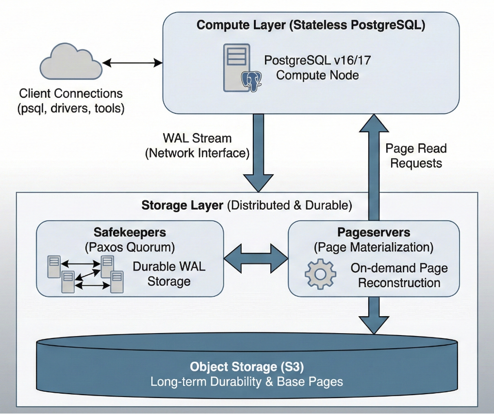

On February 3, 2026, Databricks announced the [general availability of Lakebase on AWS](https://www.databricks.com/blog/databricks-lakebase-generally-available) — a serverless PostgreSQL database built on Neon's compute-storage separation architecture, integrated with Unity Catalog governance and the Databricks analytics platform. Azure followed in beta. Thousands of companies are already running production workloads.

This is not a minor product launch. Databricks — a company valued at $134 billion with a $5.4 billion revenue run rate — is making a structural bet that PostgreSQL is the operational counterpart to the lakehouse. Snowflake made a parallel move, [acquiring Crunchy Data for ~$250 million](https://www.cnbc.com/2025/06/02/snowflake-to-buy-crunchy-data-250-million.html). The two largest analytical platforms on earth are converging on the same conclusion: operational data belongs in PostgreSQL.

The architectural implications of Lakebase extend far beyond the Databricks ecosystem. What Lakebase represents — and what it shares with Neon, Aurora Serverless, and AlloyDB — is a fundamental rethinking of what a PostgreSQL database *is*. Compute is no longer a server. It is a process that appears, executes, and disappears. Storage is no longer a local filesystem. It is a distributed, durable layer that outlives any single compute instance.

For anyone who deploys to PostgreSQL, this changes the rules.

## What Lakebase Actually Is

Lakebase is built on [Neon's open-source architecture](https://neon.com/docs/introduction/architecture-overview), which Databricks [acquired for approximately $1 billion](https://www.databricks.com/company/newsroom/press-releases/databricks-agrees-acquire-neon-help-developers-deliver-ai-systems) in May 2025. The core innovation is splitting PostgreSQL into two fully independent layers that communicate through a single interface: the Write-Ahead Log (WAL) stream.

**The compute layer** runs standard PostgreSQL — version 16 or 17, with [52 supported extensions](https://docs.databricks.com/aws/en/oltp/projects/compatibility) including pgvector, PostGIS, PL/pgSQL, and pg_stat_statements. From the perspective of a connected client, this is a PostgreSQL database. The wire protocol is standard. psql, pgAdmin, pgx, SQLAlchemy — every PostgreSQL tool works unmodified.

What changes is that this compute process owns no durable state. Instead of flushing WAL to a local filesystem, it streams WAL records over the network to the storage layer.

**The storage layer** has three tiers:

- **Safekeepers** receive WAL from compute and store it durably using a Paxos-based quorum consensus. A transaction is committed once a majority of safekeepers acknowledge the WAL record. This provides the durability guarantee.

- **Pageservers** materialize data pages by combining previously stored base pages with committed WAL records. When compute needs a page it doesn't have cached locally, it requests it from the pageserver, which reconstructs it on demand.

- **Object storage (S3)** is the ultimate source of truth. Pageservers periodically upload materialized data to S3 for long-term durability. Reads from object storage happen inside the pageserver, never on the hot query path.

This architecture means the WAL stream is the interface between compute and storage. Once you can ship WAL over a network rather than writing it to disk, compute becomes stateless and replaceable.

**Lakebase adds three capabilities on top of Neon's foundation:**

Unity Catalog governance — row-level filters, column masking, audit logging, and lineage tracking — applied to the operational database. This is significant because it means the same access policies that govern the lakehouse also govern the PostgreSQL layer.

[Moonlink](https://www.databricks.com/blog/mooncake-labs-joins-databricks-accelerate-vision-lakebase), from the Mooncake Labs acquisition (October 2025), provides real-time CDC from Lakebase to Delta and Iceberg tables. Changes in the operational database automatically flow to the analytical layer without ETL pipelines.

Synced Tables provide the reverse direction — Unity Catalog gold-layer tables replicated into Lakebase as read-only PostgreSQL tables, with configurable refresh modes from snapshot to continuous streaming.

## Scale to Zero and the Death of Assumed State

Lakebase Autoscaling supports true [scale-to-zero](https://docs.databricks.com/aws/en/oltp/projects/scale-to-zero). After five minutes of inactivity (configurable down to 60 seconds), the compute layer suspends entirely. Reactivation takes a few hundred milliseconds. Data remains safely in object storage.

This is where the architectural implications become concrete. When compute suspends and reactivates, every form of session state is destroyed:

- **Temporary tables**: gone.
- **Prepared statements**: gone.
- **Advisory locks**: gone — the connection that held them no longer exists.
- **Session variables** (`SET` parameters): gone.
- **In-memory statistics and buffer cache**: cold.
- **Active transactions**: aborted.

The data is safe. The schema is intact. But the *execution environment* — everything that existed in the compute process's memory — has been wiped.

This is not a Lakebase-specific limitation. It is a structural consequence of disaggregating compute from storage. Neon (standalone) behaves identically — default suspension after five minutes of inactivity, ~500ms cold start. [Aurora Serverless v2](https://docs.aws.amazon.com/AmazonRDS/latest/AuroraUserGuide/aurora-serverless-v2.how-it-works.html) exhibits the same pattern at a larger time scale: suspension after 5 minutes to 24 hours of inactivity, with cold start times of approximately 15 seconds (rising to 30+ seconds after extended suspension). Even [AlloyDB](https://docs.cloud.google.com/alloydb/docs/overview), which does not scale to zero, disaggregates storage in a way that makes read replicas share data without owning it.

## The Convergence

Lakebase is not an isolated product decision. It is [one instance of an industry-wide architectural convergence](https://www.infoq.com/news/2026/02/databricks-lakebase-postgresql/).

| Platform | Compute Model | Storage Model | Scale to Zero | Cold Start |
|:---------|:-------------|:-------------|:-------------|:----------|
| **Lakebase** (Databricks) | Ephemeral Postgres (Neon) | Safekeepers + Pageserver + S3 | Yes (5 min idle) | ~500ms |
| **Neon** (standalone) | Ephemeral Postgres | Same architecture (Neon origin) | Yes (5 min idle) | ~500ms |
| **Aurora Serverless v2** (AWS) | ACU-based Postgres | Aurora distributed storage | Yes (5-24 min idle) | ~15-30s |
| **AlloyDB** (Google Cloud) | Primary + read pool VMs | Log Storage + LPS + Block Storage | No | N/A |
| **Aurora DSQL** (AWS) | Per-transaction Firecracker VMs | Distributed journal | Fully serverless | Per-transaction |

Every major cloud provider is separating compute from storage at the WAL boundary. The differences are in how aggressively they pursue ephemerality. Neon and Lakebase are the most aggressive — sub-second cold starts, true scale-to-zero. Aurora Serverless is more conservative — heavier compute, longer cold starts. AlloyDB keeps compute always-on but disaggregates storage. [DSQL](https://docs.aws.amazon.com/aurora-dsql/latest/userguide/working-with-postgresql-compatibility-migration-guide.html) takes it to the extreme — each transaction runs in its own Firecracker micro-VM with no session state at all.

The trajectory is clear. PostgreSQL compute is becoming ephemeral. The question is not *whether* your deployment targets will have ephemeral compute, but *when*.

## What This Breaks

Traditional database deployment tools were designed for a world where the database server is always running, a connection is available immediately, and session state persists for the duration of the migration.

Ephemeral compute invalidates all three assumptions.

**The database may not be running when the pipeline connects.** A CI/CD runner that triggers a deployment against a Lakebase or Neon instance may face a 500ms wake-up delay. Against Aurora Serverless, 15-30 seconds. Many PostgreSQL driver libraries default to 5-10 second connection timeouts — shorter than Aurora's cold start. The migration tool fails before the database finishes waking up.

**Session state may not survive.** Migration tools that acquire advisory locks to prevent concurrent deployments (`SELECT pg_advisory_lock(...)`) rely on the lock persisting for the duration of the migration session. If the underlying connection is recycled by a pooler or interrupted by a compute scaling event, the lock disappears silently. Another deployment instance may proceed concurrently, corrupting state.

**Connection poolers break session assumptions.** Neon includes built-in PgBouncer in transaction mode. AWS recommends RDS Proxy for Aurora Serverless. Transaction-mode pooling returns connections to the pool after each transaction — `SET` parameters, temporary tables, and prepared statements do not persist between transactions. Migration tools that use `SET search_path` or create temporary tracking state across multiple transactions will produce incorrect results through a transaction-mode pooler.

**Feature availability varies wildly.** Aurora DSQL claims PostgreSQL compatibility but lacks PL/pgSQL, temporary tables, triggers, foreign keys, and JSONB. It limits transactions to 3,000 modified rows and one DDL statement per transaction. A migration script that creates a table and inserts seed data in the same transaction will fail. Any tool that generates `DO $$ ... $$` blocks is incompatible. The PostgreSQL on the other side of the wire is not always the PostgreSQL you expect.

## The Deployment Question

Lakebase itself provides some answers. Copy-on-write branching enables CI/CD patterns: create a branch, deploy schema changes, validate, merge back. Branches can have TTLs of 2-4 hours, automatically cleaning up after the CI pipeline completes. Synced Tables handle the analytical-to-operational data flow. Moonlink handles the reverse.

But branching does not solve the deployment orchestration problem — it replicates it. Each branch is a separate PostgreSQL endpoint that may or may not have active compute. The migration tool still needs to connect, manage state, and execute changes. With up to 10 branches per project, the deployment target is no longer a single database but a tree of ephemeral instances.

The deeper question is architectural. If compute is ephemeral and session state is transient, where should deployment logic live?

External migration tools maintain their own state — tracking tables, lock mechanisms, changelog parsing — in the external binary or in the database itself. When the external binary crashes, the tracking state and the database state can diverge (the problem described in detail in the mid-flight failure analysis that continues to plague every major migration framework). When the database's compute layer recycles, session-scoped coordination mechanisms disappear.

The one thing that survives across all ephemeral compute events — across scale-to-zero, across branch creation, across compute recycling — is the data in the durable storage layer. The schema. The tables. The indexes. The functions. Everything that PostgreSQL persists through WAL.

This suggests that the safest deployment model for ephemeral compute is one where the deployment logic is entirely self-contained within a single database session. No state carried between sessions. No external tracking tables that can diverge from reality. No advisory locks that need to survive connection recycling. The deployment connects, executes its logic within the database's native transactional boundaries, and disconnects. If it fails, it fails atomically — the database's own transaction manager rolls back to a consistent state.

PostgreSQL already provides every capability needed for this model. Transactional DDL for atomic schema changes. Savepoints for nested isolation. PL/pgSQL for conditional logic and exception handling. System catalogs for querying ground-truth state. These capabilities persist in the durable storage layer — they survive scale-to-zero, compute recycling, and branch creation.

As Data Platform Architects, we have spent years designing systems around the assumption that the database is a persistent server. Lakebase, Neon, and Aurora Serverless are removing that assumption. The tools and patterns we use to deploy to these databases need to follow.

The compute is ephemeral. The storage is durable. The deployment logic needs to know the difference.
