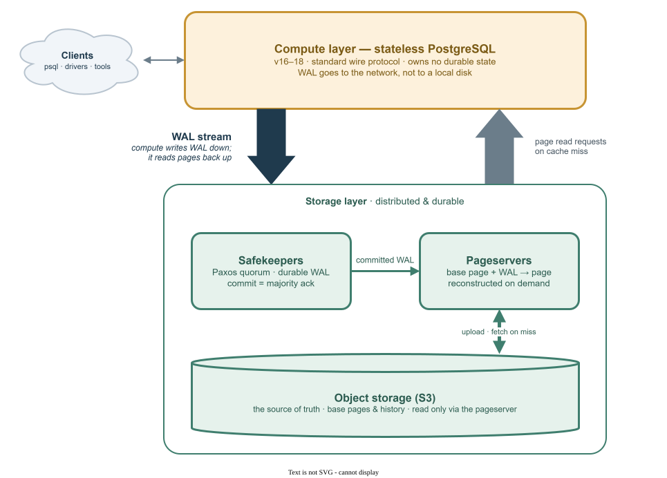

On February 3, 2026, Databricks announced the [general availability of Lakebase on AWS](https://www.databricks.com/blog/databricks-lakebase-generally-available) — a serverless PostgreSQL database built on Neon's compute-storage separation architecture, integrated with Unity Catalog governance and the Databricks analytics platform. Azure followed in beta. Thousands of companies are already running production workloads.

This is not a minor product launch. Databricks — valued at $134 billion after its December 2025 Series L, and reportedly [raising again at $188 billion](https://www.databricks.com/company/newsroom/press-releases/databricks-raising-strategic-round-funding-188-billion-valuation) by July 2026, with Lakebase named as one of the bets the round doubles down on — is making a structural claim that PostgreSQL is the operational counterpart to the lakehouse. Snowflake made a parallel move, [acquiring Crunchy Data for ~$250 million](https://www.cnbc.com/2025/06/02/snowflake-to-buy-crunchy-data-250-million.html). The two largest analytical platforms on earth are converging on the same conclusion: operational data belongs in PostgreSQL.

The architectural implications of Lakebase extend far beyond the Databricks ecosystem. What Lakebase represents — and what it shares with Neon, Aurora Serverless, AlloyDB, and now Microsoft's Azure HorizonDB — is a fundamental rethinking of what a PostgreSQL database *is*. Compute is no longer where durable state lives. On some platforms it stays provisioned but replaceable; on others it suspends entirely between queries. Storage is no longer a local filesystem — it is a distributed, durable layer that outlives any single compute instance.

For anyone who deploys to PostgreSQL, this changes the rules.

## What Lakebase Actually Is

Lakebase is built on [Neon's open-source architecture](https://neon.com/docs/introduction/architecture-overview), which Databricks [acquired for approximately $1 billion](https://www.databricks.com/company/newsroom/press-releases/databricks-agrees-acquire-neon-help-developers-deliver-ai-systems) in May 2025. The core innovation is splitting PostgreSQL into two fully independent layers connected only over the network: compute streams its Write-Ahead Log (WAL) down to storage and requests data pages back from it, and never touches durable storage directly.

**The compute layer** runs standard PostgreSQL — version 16, 17, or 18, with [more than 50 supported extensions](https://docs.databricks.com/aws/en/oltp/projects/compatibility) including pgvector, PostGIS, PL/pgSQL, and pg_stat_statements. From the perspective of a connected client, this is a PostgreSQL database. The wire protocol is standard: psql, pgAdmin, pgx, and SQLAlchemy connect and query normally. What does *not* carry over is anything that reaches past the wire protocol — superuser access, tablespaces, native logical replication, direct server-log access — so tools that depend on those need adaptation.

What changes is that this compute process owns no durable state. Instead of flushing WAL to a local filesystem, it streams WAL records over the network to the storage layer.

**The storage layer** has three tiers:

- **Safekeepers** receive WAL from compute and store it durably using a Paxos-based quorum consensus. A transaction is committed once a majority of safekeepers acknowledge the WAL record. This provides the durability guarantee.

- **Pageservers** materialize data pages by combining previously stored base pages with committed WAL records. When compute needs a page it doesn't have cached locally, it requests it from the pageserver, which reconstructs it on demand.

- **Object storage (S3)** is the ultimate source of truth. Pageservers periodically upload materialized data to S3 for long-term durability. Compute never reads S3 directly — the pageserver mediates every remote read, fetching from object storage on a cache miss and serving warm pages from its own tiers otherwise.

This architecture means WAL is how compute *writes* to storage, and a page-service request is how it *reads* — two network interfaces where there used to be a local disk. Once both cross a network rather than a filesystem, compute becomes stateless and replaceable.

**Lakebase adds three capabilities on top of Neon's foundation:**

Unity Catalog registration brings the operational database under lakehouse governance: the Postgres database surfaces as a read-only catalog with audit logging and lineage tracking, and Unity Catalog policies — row-level filters, column masking — govern access to that data through Databricks query surfaces. The boundary worth knowing: the two access paths participate in the same Databricks governance plane, but authorization stays distinct — Unity Catalog governs the Databricks query surfaces, while direct Postgres connections are governed by Postgres roles. Aligned through one governance plane, not merged into one authorization path.

The [Lakebase change data feed](https://docs.databricks.com/aws/en/oltp/projects/lakebase-cdf) (in public preview as of mid-2026), built on the `wal2delta` extension from the [Mooncake Labs acquisition](https://www.databricks.com/blog/mooncake-labs-joins-databricks-accelerate-vision-lakebase) (October 2025), streams committed changes from Lakebase into Unity Catalog managed Delta tables in roughly 15-second batches. It does not eliminate ETL so much as remove the need to *operate* a separate CDC stack — the pipeline is the feed.

Synced Tables provide the reverse direction — Unity Catalog gold-layer tables replicated into Lakebase as read-only PostgreSQL tables, with configurable refresh modes from snapshot to continuous streaming.

## The Connection Lifecycle Becomes Explicit

Scale-to-zero is the headline feature, but the precise statement is narrower than "sessions vanish." Ordinary PostgreSQL has always dropped session-local state the moment a connection closes, and it has long had idle and transaction timeouts that can close one; managed databases have always had failovers and maintenance restarts. None of that is new. What deserves a deployment tool's attention is more specific: three operational constraints that were previously implicit or deployment-specific are now explicit product behavior.

**A cold endpoint delays the first connection.** After [scale-to-zero](https://docs.databricks.com/aws/en/oltp/projects/scale-to-zero) suspends an idle Lakebase instance — default 24 hours of inactivity, configurable from 60 seconds to 7 days — the next connection or query must wait for compute to resume. Resume is fast (~500ms on Lakebase and Neon; ~15 seconds on Aurora Serverless v2, longer after extended suspension) but not instant, and a CI job whose driver timeout is shorter than the cold start fails before the database is ready. This affects connection *establishment*: scale-to-zero occurs when there are no queries or connections, so it delays connecting — it does not interrupt a migration already in flight.

**Connections carry explicit lifetime bounds.** Lakebase [documents](https://docs.databricks.com/aws/en/oltp/projects/connect-overview) a 24-hour idle timeout and a three-day maximum connection lifetime. A deployment that assumes one connection can be held open indefinitely — a long backfill, or a lock held for the duration — now has an upper bound to design within. When the connection ends, session-local state ends with it, exactly as PostgreSQL has always behaved; what is new is only that Lakebase makes these connection limits explicit and mandatory.

**Transaction pooling removes backend affinity by design.** Lakebase provides a built-in pooled connection endpoint (PgBouncer in transaction mode) alongside the direct one. Transaction-mode pooling returns the backend to the pool after every transaction, so session-local state deliberately does not carry between transactions — a `SET search_path`, a temporary table, or a SQL-level prepared statement (`PREPARE` / `EXECUTE`) created in one transaction is not visible in the next. (Databricks documents driver-level, protocol prepared-statement support separately; that is a different mechanism from SQL-level `PREPARE`.) This is the pooler working as specified, not a failure — and it is separate from suspension: an associated RDS Proxy keeps a connection open to an Aurora Serverless cluster, which prevents it from auto-pausing.

Two distinctions are worth holding onto, because they are easy to blur. *Autoscaling* changes how much compute a running instance has and does not drop live connections; *scale-to-zero* suspends an idle instance entirely — different mechanisms. And *session-local* state (temporary tables, prepared statements, session `SET` parameters, advisory locks, an open transaction) lives and dies with the connection, whereas *compute-local shared* state (the buffer cache, cumulative statistics) is merely cold after a resume and warms back on its own — a performance effect, not a correctness one.

The practical rules for a deployment tool follow directly. When it needs session semantics — an advisory lock, a temporary table, a session GUC held across statements — it should take a **direct, unpooled connection**, not a transaction-mode pooler. It should set connection timeouts comfortably above the target's cold-start time. And it should treat any reconnect as a **new attempt** that revalidates durable state before proceeding, never as a resumption of the session it left behind.

## The Convergence

Lakebase is not an isolated product decision. It is [one instance of an industry-wide architectural convergence](https://www.infoq.com/news/2026/02/databricks-lakebase-postgresql/).

There are really two axes here, and it is worth keeping them apart. One is **disaggregation**: whether storage is separated from compute so that a compute node owns no durable state. The other is **ephemerality**: whether the compute — and therefore the *session* — is transient. Disaggregation makes compute *replaceable*; it does not by itself make sessions disappear. The platforms below have converged on the first axis while spreading across the second.

| Platform | Compute Model | Storage Model | Compute Lifecycle | Cold Start |
|:---------|:-------------|:-------------|:-------------|:----------|
| **Lakebase** (Databricks) | Stateless Postgres (Neon) | Safekeepers + Pageserver + S3 | Suspends after idle (60 s – 7 d, default 24 h) | ~500ms |
| **Neon** (standalone) | Stateless Postgres | Same architecture (Neon origin) | Suspends after idle (5 min) | ~500ms |
| **Aurora Serverless v2** (AWS) | ACU-based Postgres | Aurora distributed storage | Pauses after idle, only with no open connections (5 min – 24 h) | ~15-30s |
| **AlloyDB** (Google Cloud) | Primary + read pool VMs | Log Storage + LPS + Block Storage | Provisioned | N/A |
| **HorizonDB** (Microsoft Azure) | Stateless scale-out Postgres | Durable WAL service + sharded storage + Blob | Provisioned | N/A |
| **Aurora DSQL** (AWS) | Elastic query processor per connection | Distributed journal | Per-connection | Not publicly specified |

Every platform here separates compute from storage across a durability-log boundary — PostgreSQL WAL in several designs, a distributed journal in DSQL — and that is the settled part. Where they differ is on the second axis. Neon and Lakebase pursue ephemerality hardest: sub-second cold starts and true scale-to-zero, so an idle database has *no* running session. Aurora Serverless is more conservative and, crucially, only pauses when there are no open connections. AlloyDB and Microsoft's [Azure HorizonDB](https://learn.microsoft.com/en-us/azure/horizondb/overview) — unveiled at Ignite in late 2025 and in [public preview since mid-2026](https://learn.microsoft.com/en-us/azure/horizondb/release-notes/release-notes) — disaggregate storage fully but keep compute provisioned; they demonstrate that separation makes compute replaceable without making it transient. HorizonDB is worth naming precisely: its writes flow through a durable WAL service, but storage also includes a sharded data fleet and Azure Blob durability, and it does not scale to zero. [Aurora DSQL](https://docs.aws.amazon.com/aurora-dsql/latest/userguide/working-with-postgresql-compatibility-migration-guide.html) sits at its own corner — a dedicated query processor per connection, no shared session pool — so its compute is serverless yet still connection-scoped.

The trajectory on the first axis is clear: PostgreSQL compute is being separated from storage everywhere. Ephemerality is the *additional* property some of these platforms layer on top — and it is the one that changes what deployment tooling can assume.

### PostgreSQL Compatibility Is a Separate Axis

One more axis cuts across both of the above: how completely a platform implements PostgreSQL. As of July 2026, Aurora DSQL is PostgreSQL-compatible but does not support PL/pgSQL, temporary tables, triggers, or foreign keys. Its transaction model also permits at most 3,000 mutated rows and one DDL statement per transaction, and it does not allow DDL and DML in the same transaction. A migration that creates a table and inserts seed data within one transaction will therefore fail, as will scripts that rely on `DO $$ ... $$` blocks. Compatibility is evolving quickly—native JSONB support arrived in June 2026—so deployment tooling should treat each platform as a versioned capability target and validate assumptions against current documentation.

## The Deployment Question

Lakebase provides some of the primitives needed for lifecycle-safe deployment. Copy-on-write branching enables CI/CD patterns: create a branch, deploy schema changes, validate, merge back. Branches can be given a TTL — from one hour up to 30 days — so a CI branch cleans itself up after the pipeline completes. Synced Tables handle the analytical-to-operational data flow. The Lakebase change data feed handles the reverse.

But branching does not solve the deployment orchestration problem — it replicates it. Each branch is a separate PostgreSQL endpoint that may or may not have active compute. The migration tool still needs to connect, manage state, and execute changes. With up to 10 unarchived branches per project (500 in total), the deployment target is no longer a single database but a tree of ephemeral instances.

The deeper question is architectural. If the session can end mid-deployment, what may deployment logic safely depend on?

The tempting answer — "put everything in one session so it's atomic" — is too strong, in two ways. First, a single session does *not* guarantee atomicity: the operations that matter most under load, `CREATE INDEX CONCURRENTLY` and `VACUUM`, cannot run inside a transaction block at all, so a real migration spans multiple commits by necessity. Second, durable coordination state is not the liability it is sometimes made out to be. A migration-history table lives in the same durable storage as your application tables; it survives scale-to-zero exactly as they do. The real hazard is narrower: partially completed non-transactional work (a half-built `CONCURRENTLY` index, a batch applied but not recorded) combined with too little durable progress information to tell what actually finished — so a crashed external binary and the database can end up disagreeing about where the deployment stopped ([a failure mode I explored separately](/posts/database-deployments-wrong-2026/)).

Session-scoped coordination is the clearest correctness hazard. If a deployment loses its direct connection, PostgreSQL releases its advisory lock and rolls back any open transaction. That alone does not corrupt state. The risk appears when the attempt has already committed multi-transaction or nontransactional steps and another attempt begins before reconciling durable progress. After reconnecting, the tool must reacquire coordination and re-read durable state before continuing.

What genuinely does not survive a suspend-and-resume is anything scoped to the *connection*: advisory locks, temporary tables, `SET` parameters, an open transaction. So the property to design for is narrower and more precise than "one session." Deployment tooling for these platforms should:

- **Tolerate cold starts and reconnects** — generous connection timeouts, retry with backoff, no assumption the endpoint is warm.
- **Not depend on session state surviving a reconnect** — no cross-transaction advisory locks or temp-table coordination. If coordination must outlive a connection, use a durable *lease*, not a bare flag: an attempt record carrying an owner ID, an expiry, and a fencing token (a monotonic generation number), acquired and renewed atomically and re-checked before each protected step. A `locked = true` row without expiry and fencing is worse than no lock — it goes permanently stale the first time its holder dies.
- **Persist enough durable coordination state to resume safely** — and make each step idempotent and resumable, so re-running after an interrupted attempt converges rather than corrupts.

PostgreSQL supplies the raw materials for exactly this: transactional DDL for the steps that *can* be atomic, savepoints for nested isolation within a transaction, system catalogs for querying ground-truth state instead of trusting an external changelog, and durable tables for coordination that has to outlive a connection. All of it lives in the storage layer, so all of it survives the compute going away.

As Data Platform Architects, we have spent years assuming the database is a persistent server holding a stable session. Two forces are pulling those apart. Disaggregation makes compute *replaceable* — it removes durable state from the compute node, nothing more. Managed compute and connection lifecycles then make the *connection* disposable: scale-to-zero, failover, and lifetime caps end sessions that used to last as long as you wanted. The data is as durable as ever; it is the connection that has become disposable. Deployment logic needs to know which is which.

---

**Disaggregation changes where authority can sit. It does not change the requirement that the decision sit with it.** That requirement is stated on its own in [*A Decision Belongs Where Its Authority Lives*](/locality-of-authority/).
