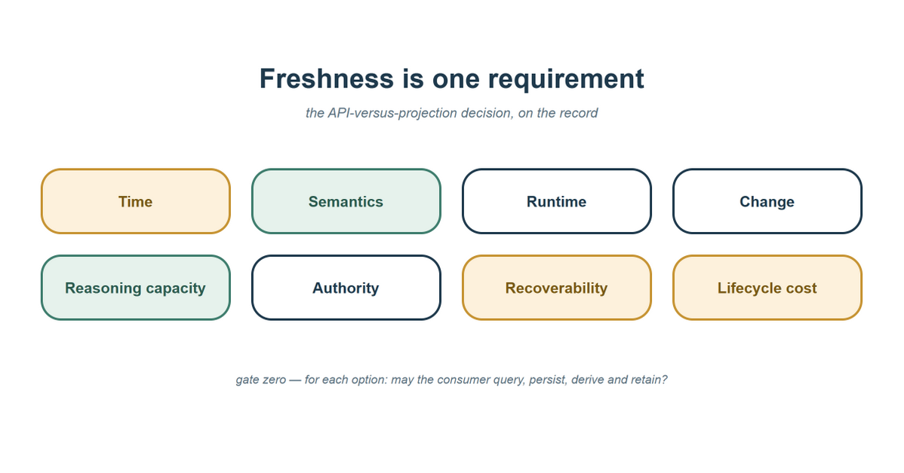

<!-- STATUS: draft R5 (2026-07-17) — fifth review round applied: EIGHT dimensions
     (runtime behavior split from evolution/change coupling); per-option
     evaluation (requirement column + API/Projection/Federation comparison
     table; per-option ADR template); semantic-vs-reasoning contrast added;
     "not intelligence or compute" disclaimer; watermark → COMPLETENESS
     FRONTIER (contract term, distinguished from Beam's heuristic watermarks);
     hybrid conclusion named; Azure characterization corrected; composite-
     example label; central thesis ("the unit of design is the decision");
     axes visual embedded inline; redesigns-per-integration-year metric +
     blind classification + "operational evaluation" framing; ~10% compressed
     (federation prose folded into comparison table, lineage tail trimmed);
     diagram headline more immediate; 8-pill social card.
     MANDATORY before publication: Essay-1-reception revision round.
     TODO: final date; series taxonomy after AGP-7; LTAP/Lakebase + Trino
     re-check at publication; essay-1 tease + kit consistency (now EIGHT
     dimensions); optional re-verify empirical papers. -->

Every architecture review of a data integration reaches the same moment.
Someone proposes keeping a local copy of another domain's data, and someone
else says the sentence that ends the discussion: *"But the copy will be
stale. The API gives us the current truth."*

The sentence sounds rigorous, and it smuggles in two assumptions. First,
that the owner's read path is itself current — when it may serve from a read
replica, a cache, an asynchronously updated index, or a materialized view of
its own. Second, that facts returned by several owners describe a coherent
moment — when three sequential calls can each be individually fresh while
describing three incompatible instants. Neither follows merely from making
the calls *now*. Grant the API its usual advantage — it is often fresher,
fact by fact — and the sentence still covers one component of one dimension
of the decision.

This essay names the other dimensions. It is the second in a series; the
[first](/posts/your-operational-data-is-someone-elses-reference-data/) argued
that operational and reference are roles a dataset plays, not properties, and
that the publish → refine → project → join-locally loop deserves first-class
status. This one turns the trade at the center of that loop into an
instrument you can put on the table at Monday's review.

## The question with no per-call answer

Consider a composite example, assembled from patterns most platform teams
will recognize. A payments team is asked to flag accounts whose spending
pattern this week diverges from their twelve-month baseline *and* whose
account standing changed recently *and* whose plan tier makes the divergence
commercially significant. Three domains: transactions (theirs), account
standing (another team's), plan catalog (a third team's).

The naïve per-entity composition version of this feature is a distributed
query engine assembled from meetings: page through accounts, call standing
for each, call the plan service, join in application code. Each call is
fresh — and the whole is operationally poor at large fan-out, unrunnable
during a dependency's incident, and frozen the moment the product manager
changes "current plan tier" to "**plan tier at the time of each
transaction**" — or asks whether an account's standing changed twice in the
preceding ninety days. No current-state endpoint can answer either question,
however fresh: the answers live in the *history* of another domain's data,
and the provider's interface never promised history. (Better API-side
designs exist — bulk endpoints, provider-side query endpoints, purpose-built
aggregates, cached compositions — and each is simply a different position in
the trade space this essay maps.)

The projection version is one SQL query over three local tables, two of them
maintained by governed feeds from the owning domains — feeds that retain
standing and plan changes as **effective-dated history**, not only
current-state upserts. Plan-tier-at-transaction-time becomes a join against
that history.

Here is the thesis the rest of this essay serves: **the unit of design is
not the API call or the copied table. It is the decision — the evidence it
requires, and the consequences of being wrong.** Optimize the decision, not
the transport, and the stale-copy argument takes its correct size: one
requirement among several.

## Gate zero, then eight dimensions

Before any trade-off, one question is a gate, not a dimension — and it must
be asked **separately for each candidate design**, because "query,"
"persist," "derive," and "retain" are materially different permissions. A
policy may permit an API call while prohibiting a durable copy; it may allow
a projection with a seven-day retention limit while prohibiting historical
reconstruction; it may allow holding a raw fact but not the derived risk
classification.

> **Gate zero — admissibility.** For this option: may the consumer query,
> persist, derive from, and retain the required data, at the proposed
> granularity, for the stated purpose? Consider residency, purpose
> limitation, tenant isolation, retention and erasure, and sensitive
> attributes.

The outcome is graded, not binary: *inadmissible*; *admissible with
constraints* (retention limits, minimized columns, row-level entitlement in
the product contract); *admissible only through an owner-mediated or
federated read*; or *admissible as a derived, minimized product*.

Past the gate, eight dimensions. For each, state the decision's
*requirement* — then record evidence for **every surviving option** against
it. (A complete, copyable ADR template appears at the end.)

| Dimension | The question to ask out loud | What to record |
|---|---|---|
| **Temporal fidelity** | What maximum age, lag, and cross-source skew are acceptable? Is a coherent snapshot or causal order required — and how is it *produced*? | Max age / lag SLO, `as_of` visibility, coherence mechanism (completeness frontier, skew bound, snapshot token) |
| **Semantic fidelity** | Does the representation preserve the meaning, identity, completeness, and precision this decision requires? | Semantic owner, identifier mapping, units, completeness SLO, correction and deletion behavior |
| **Runtime behavior** | What response latency, throughput, and availability does the decision need — and what must be healthy when it executes? | p95/p99 target, fan-out, dependency set, degraded behavior |
| **Evolution & change coupling** | Which upstream schema or semantic changes require coordinated work — and who coordinates? | Versioning policy, blast radius of a breaking change, teams and contracts affected |
| **Reasoning capacity** | Which questions and derivations are supported by the data, history, and contracts already available — without an upstream contract change? | Joinable dimensions and keys, granularity, history depth, past-state reconstruction; contract changes required for a new question |
| **Authority** | Who validates and commits the authoritative state transition? | The invariant's owner and the owner-mediated command path |
| **Decision consequence & recoverability** | If stale, incomplete, or incoherent knowledge produces a wrong decision, what does it cost, what detects it, and what corrects it? | Revalidate-before-acting, compensation, human review, or irreversible external effect |
| **Economics & operability** | What is the total lifecycle cost of each design, honestly counted? | Calls, egress, storage, pipelines, replay and divergence repair, observability, on-call |



And one instruction for using the table: **the dimensions are not votes.**
An option either meets a requirement, meets it with a named control, fails
it, or is vetoed outright by admissibility or authority. Record the decisive
differences; do not count wins.

Two of these dimensions are close enough to conflate, so here is the
contrast directly. **Semantic fidelity asks whether a computed answer means
the right thing. Reasoning capacity asks which answers can be computed at
all** from the available information and contracts. You have
`account_state`, but `active` means different things in two domains:
semantic failure. You have correctly defined current state, but no history:
reasoning-capacity limitation. You have history but incompatible account
identifiers: both — the semantic mismatch removes the join from the feasible
space. And to head off the obvious misreading: **reasoning capacity here is
not intelligence or compute.** It is the expressive capacity of the
information already inside the consumer's boundary.

## Temporal fidelity: age is not coherence

Three different guarantees get conflated in every staleness argument. A
transaction over a local projection guarantees that the query sees *one
committed state of the projection*. It does not guarantee that every fact in
that state describes *the same business instant*: if account standing was
observed at 10:03 and plan tier at 10:07, querying both in one local
transaction does not make them temporally coherent. An `as_of` column makes
the mismatch *visible*; it does not eliminate it. Coherence requires an
explicit rule. For the payments case, it fits in four lines:

```text
decision_cutoff = min(transaction_frontier,
                      standing_frontier,
                      plan_frontier)
maximum permitted frontier skew: 60 seconds
```

In this instrument, a **completeness frontier** is a *contractual* claim
that the source is complete through event time *t*, subject to its stated
late-correction policy. The name is deliberate: in stream processing,
["watermark" usually means a heuristic estimate](https://beam.apache.org/documentation/basics/)
of completeness, and `max(event_time)` observed is neither — treating it as
a frontier manufactures false coherence. Three separate properties then fall
out: the *common cut* (`min` of frontiers) makes a coherent read
reconstructable; the *age* of that cut relative to decision time is the
freshness requirement; and the *skew* between frontiers bounds how unevenly
the sources have progressed. A cut can be perfectly coherent and still too
old — which is the thesis in miniature.

Retained history makes an earlier coherent cut reconstructable — but only
combined with those frontier guarantees, effective-time semantics, and an
explicit correction policy. Current-state-only projections cannot
reconstruct any cut at all. And the same honesty cuts the other way: APIs
can provide coherence too, through snapshot tokens, version-bound reads, or
provider-side composition. The trade is not "API incoherent, projection
coherent" — it is whether the chosen design *has an explicit coherence
mechanism*. Most per-call compositions silently have none.

## Reasoning capacity

**Reasoning capacity is the set of questions and derivations supported by
the data, history, and contracts already available to the consumer — without
an upstream contract change.**

It is a property of the information space, measurable on its own terms:
which fields and dimensions are present; which join keys and identifiers are
compatible; at what granularity; how deep the history is, and whether past
state can be reconstructed; which transformations are permitted; and — the
operational tell — how many upstream contract changes a new question
requires. Latency, availability, and cost constrain what is *practical*;
they live in their own rows. Lead time from question to production answer is
an observed *consequence* of reasoning capacity and change coupling
together — worth tracking, not part of the definition.

The contrast with the per-call design is then precise: **a call can make a
question logically expressible while the composition needed to answer it is
operationally out of reach; a projection expands the set of questions
answerable without renegotiating any upstream contract.** With
effective-dated projections local, plan-tier-at-transaction-time is answered
the afternoon it is asked. Without a sufficiently expressive data or query
contract, the feasible-question set collapses to what the provider
anticipated when the interface was designed.


## Walking the table — every option, on the record

State each requirement, then score all three candidates against it. This is
what the review record should look like:

| Dimension | Required here | API / composition | Projection | Federation |
|---|---|---|---|---|
| Admissibility | Retain standing at account grain, fraud-review purpose | Admissible (query-only) | Admissible **with** entitlement + retention clauses | Admissible **if** policy translates across sources |
| Temporal fidelity | Minutes-old acceptable; coherent historical cut required | Fresh current state; **no historical cut** | Effective-dated history + completeness frontiers | Current reads; **no cross-source cut** |
| Semantic fidelity | Standing states mapped to review taxonomy | Owner's semantics at call time | Owner-mapped per contract; corrections flow | Connector-exposed; mismatches land on consumer |
| Runtime behavior | Full fan-out screening during provider deploy windows | **Fails** availability at fan-out | Meets — local batch query | Needs every source + engine healthy |
| Evolution & change | Survive upstream schema evolution | Insulated per call shape | Versioned feed, 90-day overlap — on the record | Every source schema in the query surface |
| Reasoning capacity | Reconstruct standing & plan history across 3 domains | **Requires two new contracts** | Already available | Only if sources expose history |
| Authority | Freezing must hit the owner's invariant | Command path exists | Read-only — freeze goes via owner path | Read-only |
| Consequence & recoverability | Flag reversible (human review); freeze irreversible | Same for all options: flag cheap, freeze dear | Flagging on minutes-old data acceptable | Reproducibility needs a captured cut |
| Economics & operability | Recurring, high fan-out, quarterly reshaping | Per-call cost + rate-limit negotiation | Feeds on the existing platform | Per-query engine + egress |

**The selected architecture is therefore hybrid: projected knowledge for
screening, an owner-mediated command for action.** The framework did not
pick an integration style; different decision stages produced different
boundaries — and that is the most useful lesson in the table. Say the
result's logic out loud: *reasoning capacity selected the read design;
decision consequence selected the action boundary.* The same minutes-old
data is acceptable for the reversible decision and would be unacceptable for
the irreversible one.

Two honesty notes on the record. The economics row holds *under these
assumptions* — an existing feed platform, quarterly reshaping, high fan-out;
make this the only consumer running monthly with no platform, and the call
column wins that row honestly. And the authority row's "command path" is a
coordination requirement, not a transport: a synchronous API, a queued
command, or an owner-mediated step within a saga all qualify, provided the
owning domain validates and commits against its current invariant.

Federation deserves one stress-test note beyond its column: its reach is
bounded by connector coverage and pushdown — under current
[Trino rules](https://trino.io/docs/current/optimizer/pushdown.html), a
cross-catalog join cannot be pushed into either source, so the engine
retrieves source-side results and joins them itself. In this example,
federation earns its place for interactive, occasional, freshness-hungry
analysis — and loses it for an always-on path that must survive provider
outages. Under different requirements the columns land differently; that is
the instrument producing a contextual conclusion rather than a doctrine.

## Whose shoulders, briefly

Three references carry most of the lineage. Pat Helland fixed the temporal
endpoints in [2005](https://www.cidrdb.org/cidr2005/papers/P12.pdf): data
crossing a service boundary "is always from the past," and joining another
system's transaction is "a serious ceding of independence." The local read
model is well-trodden — CQRS, Fowler's
[event-carried state transfer](https://martinfowler.com/articles/201701-event-driven.html),
and closest of all Chris Richardson's
[command-side replica](https://microservices.io/patterns/data/command-side-replica.html),
which weighs ten named forces including runtime *and* design-time coupling —
a split this essay's dimensions preserve. And Daniel Abadi's
[PACELC](https://www.cs.umd.edu/~abadi/papers/abadi-pacelc.pdf) is the
precedent for the whole move: he extended CAP because it "does not constrain
any system capabilities during normal operation" — a famous framework,
missing the dimension that operates all the time.

What I have not found — there, in
[Azure's data guidance](https://learn.microsoft.com/en-us/azure/architecture/microservices/design/data-considerations)
(which acknowledges query-shaped materialized views and differing query
requirements, but does not make *the breadth of future questions answerable
without upstream change* an explicit comparison dimension), or elsewhere I
have checked — is a compact instrument for comparing calls, projections, and
federation in which that property is itself named and evaluated per option.
Whether this table is the first hardly matters; what matters is whether
putting the row on the review changes decisions. (Further lineage:
Kleppmann's
[inside-out architecture](https://martin.kleppmann.com/2015/11/05/database-inside-out-at-oredev.html),
the [unbundled database](https://www.confluent.io/blog/leveraging-power-database-unbundled/),
Denning's [locality principle](https://denninginstitute.com/pjd/PUBS/CACMcols/cacmJul05.pdf).
Vendors are productizing the projection step —
[Lakebase](https://docs.databricks.com/aws/en/oltp/) synced tables, the
announced "[LTAP](https://www.databricks.com/company/newsroom/press-releases/databricks-launches-ltap-first-lake-transactionalanalytical)"
category — and every such pitch is a position on a few of these dimensions;
none answers semantics, authority, recoverability, or the gate for you.)

## An operational evaluation, and an exercise

The honest test of this framework is operational, not causal: teams that
adopt it may also simply be maturing. Still, it can be evaluated. Record
assumptions and unresolved risks in each new integration ADR; follow each
integration; count **material redesigns per integration-year** — where
"material" means a new integration mode, persisted copy (or removal of one),
upstream contract, authority path, consistency mechanism, or
privacy/retention model — normalized by integration complexity and
requirement-change frequency; have someone classify each redesign's cause
*without seeing* which dimensions the original ADR completed; and compare
against a defined class of the team's historical integrations. My
prediction: the reviewed cohort shows a lower rate, and the dimension
missing from the original review predicts the failure class. I have found no
verified empirical work on this question — which is why it is a prediction,
not a finding.

The exercise you can run today is humbler: take your last ten integration
redesigns and, for each, name the requirement absent from the original
review. If it maps to a dimension here, the instrument had an explicit place
where that requirement could have been raised. If it doesn't map to any —
that is evidence this framework is missing one, and that is precisely what I
want to hear about.

## The instrument, ready to copy

"But the copy will be stale" is one row of a gated, eight-row, per-option
decision. Here is the review template — paste it into the ADR:

```text
Integration decision:
Candidate options:         [ call | projection | federation | hybrid ]

FOR EACH CANDIDATE OPTION:
    Admissibility gate:    may this consumer query / persist / derive from /
                           retain the data? (granularity, purpose, residency,
                           retention, entitlement)
    Evidence by dimension:
        Temporal fidelity:     age, lag, skew; coherence mechanism
                               (completeness frontier / skew bound / token)
        Semantic fidelity:     meaning, identity mapping, units, completeness;
                               corrections & deletions; semantic owner
        Runtime behavior:      p95/p99, throughput, fan-out; dependency set;
                               degraded behavior
        Evolution & change:    versioning policy; blast radius of upstream change
        Reasoning capacity:    questions answerable without upstream change;
                               history depth, joinable dimensions & keys
        Authority:             who commits, via which owner-mediated path
        Consequence &          cost of a wrong decision; detection;
        recoverability:        correction (revalidate / compensate / review)
        Economics &            lifecycle cost incl. replay, divergence repair,
        operability:           observability, on-call
    Unmet requirements:
    Required controls:
    Vetoed by:

Chosen design (may be hybrid — read path and action path can differ):
Decisive differences (not vote counts):
Assumptions to verify:
```

*This is the second essay in a series on data-first architecture. The
[first](/posts/your-operational-data-is-someone-elses-reference-data/)
introduced role reversal — publish your reality, project theirs, join
locally. The next one asks what happens when the consumer doing the
reasoning is not a team but an AI agent.*

Which dimension is missing from your architecture-review template — and what
did its absence cost you? Real stories, especially ones where a projection
was the wrong call, are exactly what I'm collecting.
