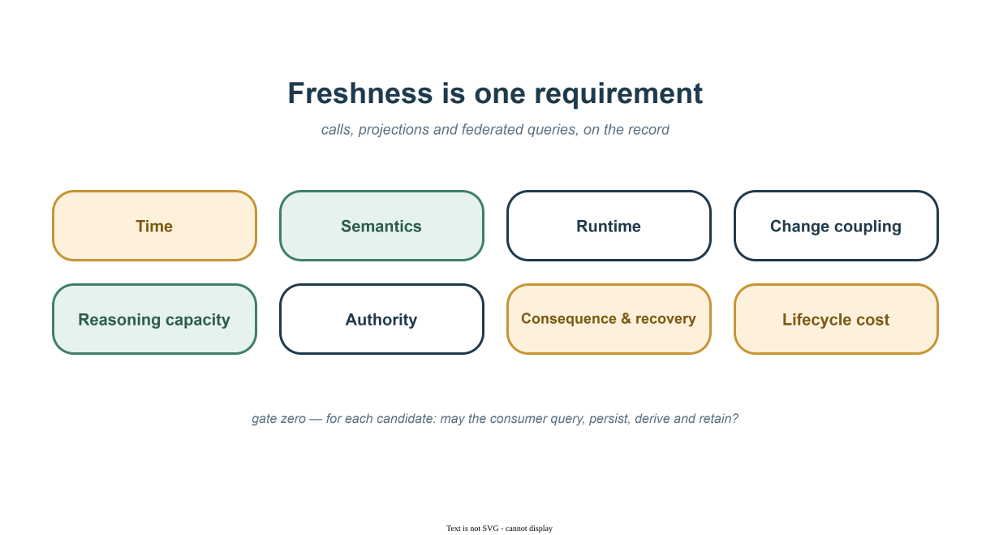

Every architecture review of a data integration reaches the same moment.
Someone proposes keeping a local copy of another domain's data, and someone
else says the sentence that ends the discussion: *"But the copy will be
stale. The API gives us the current truth."*

The sentence sounds rigorous, and it smuggles in two assumptions. First,
that the owner's read path is itself current — when it may serve from a read
replica, a cache, an asynchronously updated index, or a materialized view of
its own. Second, that facts returned by several owners describe a coherent
moment — when three sequential calls can each be individually fresh while
describing three incompatible instants. Neither follows merely from making
the calls *now*. Grant the API its usual advantage — it is often fresher,
fact by fact — and the sentence still covers one component of one dimension
of the decision.

This essay names the other dimensions. It is the second in a series; the
[first](/posts/your-operational-data-is-someone-elses-reference-data/) argued
that operational and reference are roles a dataset plays, not properties, and
that the publish → refine → project → join-locally loop deserves first-class
status. This one turns the trade at the center of that loop into an
instrument you can put on the table at Monday's review.

## The question with no per-call answer

Consider a composite example, assembled from patterns most platform teams
will recognize. A payments team is asked to flag accounts whose spending
pattern this week diverges from their twelve-month baseline *and* whose
account standing changed recently *and* whose plan tier makes the divergence
commercially significant. Three domains: transactions (theirs), account
standing (another team's), plan catalog (a third team's).

The naïve per-entity composition version of this feature is a distributed
query engine assembled from meetings: page through accounts, call standing
for each, call the plan service, join in application code. Each call is
fresh — and the whole is operationally poor at large fan-out, unrunnable
during a dependency's incident, and frozen the moment the product manager
changes "current plan tier" to "**plan tier at the time of each
transaction**" — or asks whether an account's standing changed twice in the
preceding ninety days. No current-state endpoint can answer either question,
however fresh: the answers live in the *history* of another domain's data,
and the provider's interface never promised history.

The projection version is one SQL query over three local tables, two of them
maintained by governed feeds from the owning domains — feeds that retain
standing and plan changes as **effective-dated history**, not only
current-state upserts. Plan-tier-at-transaction-time becomes a join against
that history.

Here is the thesis the rest of this essay serves: **the unit of design is
not the API call or the copied table. It is the decision — the evidence it
requires, and the consequences of being wrong.** Optimize the decision, not
the transport, and the stale-copy argument takes its correct size: one
requirement among several.

## Three archetypes, and their combination

The candidates this essay compares are archetypes, not an exhaustive
taxonomy:

- **Call / composition** — retrieve evidence from the owners at decision
  time.
- **Projection** — maintain a consumer-queryable representation ahead of
  decision time.
- **Federation** — query owner-controlled sources through a shared query
  engine, without maintaining a consumer copy.
- **Hybrid** — different mechanisms for different stages of the same
  decision.

Bulk APIs, provider-side aggregates, caches, and shared-storage views are
all evaluable as concrete candidates within or between these — which is the
operative word. The framework below is applied to *candidate designs*, never
to integration styles in the abstract.

## Gate zero, then eight dimensions

Before any trade-off, one question is a gate, not a dimension — and it must
be asked **separately for each candidate**, because "query," "persist,"
"derive," and "retain" are materially different permissions. A policy may
permit an API call while prohibiting a durable copy; it may allow a
projection with a seven-day retention limit while prohibiting historical
reconstruction; it may allow holding a raw fact but not the derived risk
classification.

> **Gate zero — admissibility.** For this candidate: may the consumer query,
> persist, derive from, and retain the required data, at the proposed
> granularity, for the stated purpose? Consider residency, purpose
> limitation, tenant isolation, retention and erasure, and sensitive
> attributes.

The outcome is graded, not binary: *inadmissible*; *admissible with
constraints* (retention limits, minimized columns, row-level entitlement in
the product contract); *admissible only through an owner-mediated or
federated read*; or *admissible as a derived, minimized product*.

Past the gate, eight dimensions. For each, state the decision's
*requirement* — then record evidence for **every surviving candidate**
against it. (A complete, copyable ADR template appears at the end.)

| Dimension | The question to ask out loud | What to record |
|---|---|---|
| **Time** *(temporal fidelity)* | What maximum age, lag, and cross-source skew are acceptable? Is a coherent snapshot or causal order required — and how is it *produced*? | Max age / lag SLO, `as_of` visibility, coherence mechanism (completeness frontier, skew bound, snapshot token — see below) |
| **Semantics** *(semantic fidelity)* | Does the representation preserve the meaning, identity, completeness, and precision this decision requires? | Semantic owner, identifier mapping, units, completeness SLO, correction and deletion behavior |
| **Runtime** | What response latency, throughput, and availability does the decision need — and what must be healthy when it executes? | p95/p99 target, fan-out, dependency set, degraded behavior |
| **Change coupling** | Which upstream schema or semantic changes require coordinated work — and who coordinates? | Versioning policy, blast radius of a breaking change, teams and contracts affected |
| **Reasoning capacity** | Which decision-relevant question classes can this candidate answer from its data, history, and query contracts — without an upstream contract change? | Joinable dimensions and keys, granularity, history depth, past-state reconstruction; contract changes required for a new question |
| **Authority** | Who validates and commits the authoritative state transition? | The invariant's owner and the owner-mediated command path |
| **Consequence & recovery** | If stale, incomplete, or incoherent knowledge produces a wrong decision, what does it cost, what detects it, and what corrects it? | Revalidate-before-acting, compensation, human review; whether the action is advisory or an authoritative external transition |
| **Lifecycle cost** | What is the total lifecycle cost of this candidate, honestly counted? | Calls, egress, storage, pipelines, replay and divergence repair, observability, on-call |



And one instruction for using the table: **the dimensions are not votes.**
A candidate either meets a requirement, meets it with a named control, fails
it, or is vetoed outright by admissibility or authority. Record the decisive
differences; do not count wins.

Two of these dimensions are close enough to conflate, so here is the
contrast directly. **Semantics asks whether a computed answer means the
right thing. Reasoning capacity asks which answers can be computed at all**
from the information and contracts available. You have `account_state`, but
`active` means different things in two domains: semantic failure. You have
correctly defined current state, but no history: reasoning-capacity
limitation. You have history but incompatible account identifiers: both —
the semantic mismatch removes the join from the feasible space. And to head
off the obvious misreading: **reasoning capacity is not intelligence or
compute.** It is the expressive capacity of the information and query
contracts already available to the decision path — a rich owner query API
can carry substantial reasoning capacity without a single local row.

## How to use it

1. Name the decision and its consequences.
2. Describe concrete candidate designs — not integration styles.
3. Apply the admissibility gate to each candidate.
4. State every requirement before assessing any candidate.
5. Record evidence, named controls, and failures per candidate.
6. Select by decisive differences, not vote count. Hybrid is a valid result.

## Walking the table — every candidate, on the record

For the payments case, the candidates are concrete:

- **API candidate:** the owners' existing current-state per-account
  endpoints; no bulk export, no history, no snapshot token.
- **Projection candidate:** effective-dated feeds from both owners onto the
  team's existing data platform; observed lag ≤ 5 minutes.
- **Federation candidate:** live queries through a shared engine across
  three separately operated catalogs.

And the requirements are stated before any candidate is scored: evidence at
most **5 minutes old**, frontier skew at most **60 seconds**, a
reconstructable historical cut, screening of **all active accounts** nightly
and on demand — including during provider deploy windows — **12 months** of
standing and plan history retained, and a two-stage consequence: flagging is
advisory and reversible via human review; freezing is an authoritative,
high-consequence state transition that requires owner-side revalidation.

| Dimension | Required here | API / composition | Projection | Federation |
|---|---|---|---|---|
| Admissibility | Retain standing & plan history at account grain, 12 months, fraud-review purpose | Admissible (query-only) | Admissible **with** entitlement + retention clauses | Admissible **if** policy translates across sources |
| Time | Age ≤ 5 min; skew ≤ 60 s; coherent historical cut | Fresh current state; **no historical cut** | Effective-dated history + completeness frontiers | Current reads; **no cross-source cut** |
| Semantics | Standing states mapped to review taxonomy | Owner's semantics at call time | Owner-mapped per contract; corrections flow | Connector-exposed; mismatches land on consumer |
| Runtime | Full fan-out screening during provider deploy windows | **Fails** availability at fan-out | Meets — local batch query | Needs every source + engine healthy |
| Change coupling | Survive upstream schema evolution | Insulated per call shape | Versioned feed, 90-day overlap — on the record | Every source schema in the query surface |
| Reasoning capacity | Reconstruct standing & plan history across 3 domains | **Requires two new contracts** | Already available | Only if sources expose history |
| Authority | Freezing must commit against the owner's invariant | Command path exists | Read-only — freeze goes via owner path | Read-only |
| Consequence & recovery | Flag advisory (human review); freeze authoritative, owner-revalidated | Same for all: flag cheap to correct; freeze dear | Flagging on ≤ 5-min-old data acceptable | Reproducibility needs a captured cut |
| Lifecycle cost | Recurring, high fan-out, quarterly reshaping | Per-call cost + rate-limit negotiation | Feeds on the existing platform | Per-query engine + egress |

These cells describe *these candidates*, not their styles in general: an
owner API with snapshot tokens or bulk history would score differently, a
federation insulated behind governed views would shift the semantics row,
and a projection can fail the runtime row in another setting. That is
precisely why step 2 of the recipe insists on concrete designs.

**The selected architecture is therefore hybrid: projected knowledge for
screening, an owner-mediated command for action.** The framework did not
pick an integration style; different decision stages produced different
boundaries — and that is the most useful lesson in the table. Say the
result's logic out loud: *reasoning capacity selected the read design;
consequence and authority selected the action boundary.* The same
minutes-old data is acceptable for the advisory decision and would be
unacceptable for the authoritative one.

Two honesty notes on the record. The lifecycle-cost row holds *under these
assumptions* — an existing feed platform, quarterly reshaping, high fan-out;
make this the only consumer running monthly with no platform, and the call
column wins that row honestly. And the authority row's "command path" is a
coordination requirement, not a transport: a synchronous API, a queued
command, or an owner-mediated step within a saga all qualify, provided the
owning domain validates and commits against its current invariant.

Federation deserves one stress-test note beyond its column: its reach is
bounded by connector coverage and pushdown — under current
[Trino rules](https://trino.io/docs/current/optimizer/pushdown.html), a
cross-catalog join cannot be pushed into either source, so the engine
retrieves source-side results and joins them itself. In this example,
federation earns its place for interactive, occasional, freshness-hungry
analysis — and loses it for an always-on path that must survive provider
outages.

And a neutrality check, made by moving the decision: a single-account
invariant check at authorization time — low fan-out, current state, no
history — selects the owner's API without a contest. A quarterly analyst
investigation across three owner catalogs, tolerant of a source being
briefly unavailable, selects federation and saves the pipeline. It was this
decision's fan-out, history depth, and deploy-window requirement that
selected the projection — not a preference for copies.

## Age is not coherence

Now the two deep dives that explain why the decisive rows behaved as they
did — first, time. Three different guarantees get conflated in every
staleness argument. A transaction over a local projection guarantees that
the query sees *one committed state of the projection*. It does not
guarantee that every fact in that state describes *the same business
instant*: if account standing was observed at 10:03 and plan tier at 10:07,
querying both in one local transaction does not make them temporally
coherent. An `as_of` column makes the mismatch *visible*; it does not
eliminate it. Coherence requires an explicit rule. For the payments case, it
fits in four lines:

```text
decision_cutoff = min(transaction_frontier,
                      standing_frontier,
                      plan_frontier)
maximum permitted frontier skew: 60 seconds
```

In this instrument, a **completeness frontier** is a *contractual* claim:
the source asserts that its originally observed event stream at or before
*t* is complete — no future delivery will extend it. Later corrections do
not break that seal; they arrive as new facts with their own record time,
never as silent revisions of the sealed range. (The term is borrowed from
[dataflow systems](https://timelydataflow.github.io/timely-dataflow/chapter_2/chapter_2_4.html),
where a frontier is a promise about future timestamps — unlike the
heuristic ["watermarks"](https://beam.apache.org/documentation/basics/) of
most stream processors.) Two practical warnings: the `max(event_time)` you
happened to observe is not a frontier, and treating it as one manufactures
false coherence; and the `min` of several frontiers is meaningful only when
the sources share a time domain and equivalent completeness semantics.

Three separate properties then fall out: the *common cut* (`min` of
frontiers) makes a coherent read reconstructable; the *age* of that cut
relative to decision time is the freshness requirement; and the *skew*
between frontiers bounds how unevenly the sources have progressed. A cut can
be perfectly coherent and still too old — which is the thesis in miniature.

And a coherent historical cut is not yet a *reproducible decision*.
Effective time records what we now believe was true at *t*; record time
captures what the decision path knew when it acted. If a standing correction
arrives tomorrow, effective last week, a reconstructed query no longer
reproduces yesterday's decision. Where decisions must be defensible, either
retain both dimensions —
[bitemporal history](https://martinfowler.com/articles/bitemporal-history.html),
Fowler's actual-versus-record time — or persist the exact evidence each
consequential decision used. This is where the time row and the
consequence-and-recovery row meet.

Current-state-only projections cannot reconstruct a prior cut — and absent
coordinated ingestion, they do not establish a coherent cross-source
*current* cut either. The same honesty cuts the other way: APIs can provide
coherence too, through snapshot tokens, version-bound reads, or
provider-side composition. The trade is not "API incoherent, projection
coherent" — it is whether the chosen design *has an explicit coherence
mechanism*. Most per-call compositions silently have none. And a change feed
is not that mechanism by itself: CDC streams and vendor change data feeds
supply incremental delivery and commit ordering — not cross-source
coherence, permanent history, semantic compatibility, or admissibility.

## Reasoning capacity

**Reasoning capacity is the set of decision-relevant question classes a
candidate can answer from the data, history, and query contracts already
available to it — at the required granularity and history depth, without an
upstream contract change.**

The definition is deliberately neutral across candidates: locality is not
part of it. It is a property of the available information and contracts,
measurable on their own terms: which fields and dimensions are present;
which join keys and identifiers are compatible; how deep the history is,
and whether past state can be reconstructed; which transformations are
permitted; and — the operational tell — how many upstream contract changes
a new question requires. Latency, availability, and cost constrain what is
*practical*; they live in their own rows. Lead time from question to
production answer is an observed *consequence* of reasoning capacity and
change coupling together — worth tracking, not part of the definition.

The per-candidate contrast is then precise. A call can make a question
logically expressible while the composition needed to answer it is
operationally out of reach. Federation's capacity is exactly what the
connected sources expose — broad across current state, thin wherever a
source withholds history. A projection expands the set of questions
answerable without renegotiating any upstream contract: with effective-dated
projections local, plan-tier-at-transaction-time is answered the afternoon
it is asked. Without a sufficiently expressive data or query contract, the
feasible-question set collapses to what the provider anticipated when the
interface was designed.

The diagram shows the **projection case** — the mechanism by which a
projection concentrates reasoning capacity into one computational boundary
where knowledge and reality can be computed together:


## The instrument, ready to copy

"But the copy will be stale" is one row of a gated, eight-row, per-candidate
decision. Here is the review template — paste it into the ADR:

```text
Integration decision:
Candidate designs:         [ call | projection | federation | hybrid ]
                           (describe each concretely — not as a style)

FOR EACH CANDIDATE:
    Admissibility gate:    may this consumer query / persist / derive from /
                           retain the data? (granularity, purpose, residency,
                           retention, entitlement)
    Evidence by dimension:
        Time:                  age, lag, skew; coherence mechanism
                               (completeness frontier / skew bound / token);
                               effective vs record time if corrections occur
        Semantics:             meaning, identity mapping, units, completeness;
                               corrections & deletions; semantic owner
        Runtime:               p95/p99, throughput, fan-out; dependency set;
                               degraded behavior
        Change coupling:       versioning policy; blast radius of upstream change
        Reasoning capacity:    question classes answerable without upstream
                               change; history depth, joinable keys & grain
        Authority:             who commits, via which owner-mediated path
        Consequence &          cost of a wrong decision; detection; correction
        recovery:              (revalidate / compensate / review); advisory vs
                               authoritative action
        Lifecycle cost:        calls, egress, storage, pipelines, replay,
                               divergence repair, observability, on-call
    Unmet requirements:
    Required controls:
    Vetoed by:

Chosen design (may be hybrid — read path and action path can differ):
Decisive differences (not vote counts):
Assumptions to verify:
```

## Whose shoulders, briefly

Three references carry most of the lineage. Pat Helland fixed the temporal
endpoints in [2005](https://www.cidrdb.org/cidr2005/papers/P12.pdf): data
crossing a service boundary "is always from the past," and joining another
system's transaction is "a serious ceding of independence." The local read
model is well-trodden — CQRS, Fowler's
[event-carried state transfer](https://martinfowler.com/articles/201701-event-driven.html),
and closest of all Chris Richardson's
[command-side replica](https://microservices.io/patterns/data/command-side-replica.html),
which weighs ten named forces including runtime *and* design-time coupling —
a split this essay's dimensions preserve. And Daniel Abadi's
[PACELC](https://www.cs.umd.edu/~abadi/papers/abadi-pacelc.pdf) is the
precedent for the whole move: extending a famous framework because it "does
not constrain any system capabilities during normal operation" — because it
was missing the dimension that operates all the time.

Reasoning capacity is the dimension I most often find absent.
[Azure's data guidance](https://learn.microsoft.com/en-us/azure/architecture/microservices/design/data-considerations)
acknowledges query-shaped materialized views and differing query
requirements, but — like the review checklists I have checked — stops short
of naming *the breadth of future questions answerable without upstream
change* as a comparison dimension in its own right. Nothing above depends on
being first; it depends on that dimension earning a row in your reviews.

**Further reading:** Kleppmann's
[inside-out architecture](https://martin.kleppmann.com/2015/11/05/database-inside-out-at-oredev.html) ·
the [unbundled database](https://www.confluent.io/blog/leveraging-power-database-unbundled/) ·
Denning's [locality principle](https://denninginstitute.com/pjd/PUBS/CACMcols/cacmJul05.pdf) ·
[Lakebase](https://docs.databricks.com/aws/en/oltp/) synced tables and the
announced "[LTAP](https://www.databricks.com/company/newsroom/press-releases/databricks-launches-ltap-first-lake-transactionalanalytical)"
category — every such product pitch is a position on a few of these
dimensions; none answers semantics, authority, recovery, or the gate for
you.

## An operational evaluation, and an exercise

The honest test of this framework is operational, not causal — adopting
teams may simply be maturing. Run it anyway: for the next ten integration
ADRs, record which dimensions were made explicit; when a redesign or
incident occurs, classify the missing requirement *without looking at* the
checklist. The framework is useful if omitted dimensions predict the
surprises, incomplete if failures repeatedly fall outside it. That is a
prediction, not a finding.

The exercise you can run today is humbler: take your last ten integration
redesigns and, for each, name the requirement absent from the original
review. If it maps to a dimension here, the instrument had an explicit place
where that requirement could have been raised. If it doesn't map to any —
that is evidence this framework is missing one, and that is precisely what I
want to hear about.

*This is the second essay in a series on data-first architecture. The
[first](/posts/your-operational-data-is-someone-elses-reference-data/)
introduced role reversal — publish your reality, project theirs, join
locally. The next one asks what happens when the consumer doing the
reasoning is not a team but an AI agent.*

Which dimension is missing from your architecture-review template — and what
did its absence cost you? Real stories, especially ones where a projection
was the wrong call, are exactly what I'm collecting.
