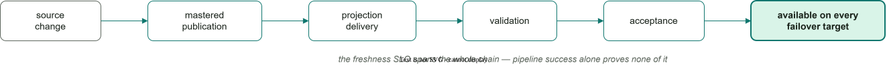

*A pattern for governed decision context, bounded freshness, and resilient operational applications*

## Abstract

Operational applications increasingly depend on knowledge mastered elsewhere: regulatory status, reference and master data, risk signals, even trained models. The architectural question is not where that knowledge is mastered, but where it is read when a decision is made. This article argues that a shared lakehouse should master and publish governed context asynchronously while each application accepts the subset it needs into its own operational boundary. A named business transaction then decides locally against operational state and accepted context together, records what it knew, and publishes its outcome. An upstream outage becomes bounded freshness lag instead of an immediate application outage. The same boundary is what makes autonomous, agentic clients safer to admit: they can be given more context than any interface exposes, and less authority.

The argument moves outward in three steps: from one business decision to the application boundary that should own it, then to the protocol by which published knowledge enters that boundary, and finally to an enterprise of domain-owned applications exchanging governed knowledge — with a look at the platforms that make the pattern practical. The implementation proof is clearly marked and skippable — the argument stands without it; the proof is there for the skeptic. The argument ends as eight questions to put to any operational system in review.

## Part I — Why the transaction boundary matters

### A failure pattern: one predicate, many serving systems

Across several projects, I have seen variations of one business decision decomposed across specialist serving systems: embeddings in a vector store, IP intelligence in another service, geographic data in a third, full-text search in a fourth, and time-ranged relational state somewhere else.

One engagement can stand for the pattern, with identifying detail removed. The system reached me as a pilot, already shaped this way; the work that followed was the deliberate rebuild into the design this article describes. The operation was an image search: given a query image, return visually similar images taken near a location, restricted to what the requesting user was permitted to see, and paid for from the customer's prepaid usage credits. Visual similarity, geography, user context, and the credit balance were served by separate systems. The similarity index could not apply the other filters, so it returned a candidate set of images — potentially a very large one — and the application filtered that set in the memory of a service never designed to be a query engine. The credit balance was the sharpest edge. It was read synchronously, so when the credits service stopped answering, search stopped with it — for about two days: a healthy retrieval capability waiting on a billing lookup, and retries only asked the same unavailable system the same question. And because the deduction lived in another system, it could not commit atomically with the result it paid for — a search that either waits on billing or works for free.

The consequence rarely appears on an architecture diagram: because no single system could execute the business predicate, the join moved into application code. Each service returned a large candidate set from its own index, and the application intersected those sets in the memory of the hosting machine. The application had become an ad hoc distributed query planner—without global statistics, shared indexes, or a common snapshot—and its memory was now sized for datasets that were never meant to be materialized in full. The client bloats to match: every additional serving system brings its own SDK, retry policy, failure mode, and partial copy of the data into the application's process.

The individual components could be healthy while the combined decision remained fragile — and not only in performance terms.

**Consistency.** The stores refreshed independently, so the combined read had no isolation level at all — it described several moments in time at once, and the resulting anomalies could not be prevented, only discovered later.

**Retrieval quality.** Filters applied after approximate search reduced recall.

**Availability.** When one required service failed while the rest stayed healthy, nobody could say what that state meant for the business; partial health was nearly as hard to reason about as correctness.

**Auditability.** When an incident review asked which combination of inputs had produced an earlier answer, the system could not reconstruct it.

Consolidating the decision context removes the distributed join and cross-store snapshot ambiguity. The same predicate—semantic similarity, network containment, geography, validity ranges, relational state—can become one indexed read inside one snapshot, with one answer to "is it available?" and one durable record of what was read. Query design, indexing, and capacity constraints remain, but they can now be managed within one transactional boundary.

The useful correction was therefore not to place every workload in PostgreSQL. It was to keep each operational decision coherent: project the external context it needed into the application's database, index the required modalities there, and record the outcome with the context version that produced it. Specialist systems remained responsible for producing knowledge; they no longer had to participate synchronously in the application transaction. The image search ended as one PostgreSQL query joining visual similarity, geographic containment, and user context in a single snapshot — with the credit deduction committing in the same transaction as the result it paid for. This failure is easy to discover late because component-level health can hide predicate-level incoherence.

<div class="wide-figure">

[![Fragmented versus coherent: on the left, one business predicate is split across a vector store, IP intelligence, a geographic service, full-text search, and a relational store; each returns a large candidate set and the application intersects them in memory—an ad hoc distributed query planner without global statistics, shared indexes, or a common snapshot—with lowered recall from post-filtering, unclear partial-service health, and unreconstructable earlier answers. On the right, the same specialist systems project external context into the application's PostgreSQL database, where vector, network, geo, full-text, validity-range, and relational modalities are indexed together; the decision becomes a single indexed read in one snapshot, recorded with the context version. Fragile combined decision on the left; coherent, auditable, resilient execution on the right.](fragmented-vs-coherent.drawio.svg)](fragmented-vs-coherent.drawio.svg)

</div>

### The design problem: external data on the transaction path

Nothing in that incident was specific to image search. Consider a payment service deciding whether to accept an incoming transaction — the simpler running case the rest of this article uses. It may need the customer's current standing, the counterparty's regulatory status, a geographical restriction, and a risk classification built from data outside the application.

The best versions of those datasets may be curated in a lakehouse. Querying them directly from the payment request can therefore look attractive: the application sees centrally governed data, and no additional serving copy appears necessary.

The difficulty begins when that remote query becomes part of the payment's success path. If the analytical platform is slow, unavailable, or temporarily inconsistent with another serving system, the payment service inherits that condition. An otherwise healthy application may become unable to decide because a platform outside its operational control did not answer.

Availability is only the visible half of the limit. The deeper half is capability. A federated read must assemble the decision's cross-dimensional intersection at request time, from engines that share no planner, no cross-system index, and no snapshot. For a latency-bounded operational predicate — a customer request, or an agent assembling a deeply grounded, multi-dimensional answer before its next step — computing that intersection on demand spends latency and capacity the transaction may not have. Application-level orchestration does not create the missing cross-system index; the working set has to be positioned and indexed before the decision arrives.

Federation earns its keep where the reader can wait or retry: dashboards, exploration, internal tools. The operational path is different: customer-facing transactions whose availability or correctness matters — approving a payment, reserving stock, admitting a request, or making another decision with a real consequence when it answers wrongly or not at all.

For those transactions, the division of responsibility is the one the image search ended with. The lakehouse masters and publishes the required data. The application receives a versioned copy, validates it, and indexes it inside its own operational database. Transactions decide locally. Their outcomes return to the lakehouse asynchronously, where they contribute to the next data product.

This pattern introduces another copy and an explicit synchronization contract. In return, the application can continue operating during an integration outage until a clearly defined freshness limit says that a particular decision must pause, degrade, or fail closed.

This is the boundary the rest of the article develops. Copying the data turns out to be the easy half; deciding when a delivered copy may be trusted is the harder one — delivery is not acceptance.

### The pattern: four responsibilities

The pattern separates four responsibilities. They do not require four products, and several may live on one platform, but it helps to keep their ownership clear.

1. **Sources** own the original facts: other operational applications, internal systems, public registries, and commercial data products.
2. **The lakehouse mastering and data-product exchange plane**—shortened here to the **knowledge plane**—reconciles, enriches, governs, versions, and publishes those facts.
3. **The application-owned serving projection** accepts the subset of published data needed by that application and indexes it for local use.
4. **Business transactions** read the accepted projection, change operational state, record why they acted, and publish their outcomes asynchronously.

These four responsibilities describe the information loop between applications.

<div class="wide-figure">

[![The decision-context loop across the four responsibilities: a source ecosystem — operational applications, internal systems, public registries, commercial data products — feeds the knowledge plane (lakehouse), which masters, fuses, governs, and publishes. Asynchronous publication as a versioned release or ordered feed crosses into the application-owned operational cell, one availability boundary, where the accepted decision projection is staged, validated, activated, and indexed. Business executions read only the active release — decide, transition, evidence, outbox — and operational events and decision evidence return to the knowledge plane over an asynchronous back channel. The missing arrow is the thesis: no synchronous call from the execution to the knowledge plane.](decision-context-loop.drawio.svg)](decision-context-loop.drawio.svg)

</div>

The critical boundary lies between the second and third responsibilities: imported decision context is published into the application before the business transaction rather than fetched synchronously from the knowledge plane during it. That choice is what lets the application keep operating when synchronization is impaired.

The lakehouse serves the application by publishing governed data; it does not need to answer every customer request. The resulting loop runs in both directions: published context improves operational decisions, while recorded decisions and events return to the knowledge plane and improve later data products.

The compact version is:

> **Master and publish. Project locally. Decide transactionally. Record the evidence.**

None of the mechanisms is novel in isolation: cell-based fault isolation, serving projections, governed business transactions, transactional outboxes, and governed data products are all established techniques. Pat Helland's [Data on the Outside versus Data on the Inside](https://www.cidrdb.org/cidr2005/papers/P12.pdf) gives the classic formulation of the underlying distinction: data inside a service is current and transactional; data that crosses the boundary is immutable, versioned, and carries provenance. The release, manifest, and watermark machinery of Part III is one operational implementation of Helland's outside data. The argument of this article is the boundary that connects them — externally mastered knowledge becomes operationally authoritative only after the application has accepted it into its own boundary, and every consequential action binds that accepted context to a governed state transition with durable evidence.

The issue is therefore not that operational applications use lakehouse data. It is that the lakehouse—or several independently refreshed serving systems—can become a runtime precondition for one business transaction. Avoiding that dependency requires a clearer account of what the application itself must contain.

## Part II — What an independently available application contains

### Decision context: what the application accepts

Most business systems already keep small reference tables beside operational state: currency codes, country lists, tax rates, or product classifications. **Decision context** names the broader category: data about the outside world that a transaction needs in order to decide correctly.

Examples include a counterparty's regulatory standing when a payment arrives, a sanctions-list revision published that morning, a geographical restriction, or a risk prior trained on data the application did not collect. This information changes on its own schedule and often originates outside the application team.

Historically, that context was represented by a handful of seed tables because little else was practical. Lakehouses and master-data platforms have raised the ceiling. They can curate, combine, govern, and version knowledge that no individual application team could assemble alone. That ceiling is an offer, not an obligation: a later section gives a five-step test — relative to one decision, not one dataset — for which context earns a projection.

Decision context is not only tabular. A trained model may also be a governed data product, built in the knowledge plane from data no single application collects and consumed by transactions that need a score, classification, or embedding.

Two serving shapes preserve the same boundary. The model artifact can be released into the operational cell and evaluated locally, in which case the decision evidence records the active model and policy versions. Or the knowledge plane can publish scores or features that the application accepts like any other versioned context. A remote inference service on the critical path is a synchronous dependency and should be assessed against the same availability budget as any other external system.

Model promotion, rollback, lineage, and evidence therefore belong in the acceptance contract rather than being treated as a separate architectural exception. In a fuller payment decision than this article's demo, one evidence row would name every versioned contributor together — the compliance release, the risk-feature release, the model version, and the policy version: one decision, several governed assets, one atomic record. Online [feature stores](https://docs.feast.dev/) solve the neighboring problem — low-latency serving with point-in-time-correct training data; the acceptance contract adds what they leave open: release identity, atomic activation, and a per-decision freshness gate.

What they do not define automatically is the application's decision contract: which copy a transaction reads, how stale it may be, what must be validated before use, and what the application records when it acts. Together, these rules form the **accepted decision-context contract**. It is the consumer-side counterpart of a [data contract](https://bitol-io.github.io/open-data-contract-standard/latest/): the producer's contract governs what is offered — schema, quality metrics, an SLA — while acceptance governs what this application is prepared to trust, and it is a transaction rather than a schema check.

The phrase "source of truth" tends to blur four different responsibilities. Each holds something different and answers a different question:

| | Responsibility | What it holds | The question it answers |
|---|---|---|---|
| 1 | **System of record** | The original fact — a public registry, an account system | What does the world say? |
| 2 | **Knowledge plane** | The governed publication — reconciled, enriched, versioned | What has been published, and under which version? |
| 3 | **Accepted decision context** | The release this application has validated and activated locally | What did *this application* accept? |
| 4 | **Decision evidence** | What the application knew at the moment it acted | What did we know when we decided? |

The last row ages differently from the other three. A year later, "why was this payment approved?" is answered by the evidence — not by whatever the sources say by then.

### The operational cell: isolate failure, bound freshness

**The operational cell** is the application, its operational database, and the consumer that brings published context into that database. In the concrete architecture developed here, PostgreSQL provides that transactional store. Its defining property is that it holds the complete working dataset of its critical transactions: operational state *and* the accepted decision context that state is evaluated against. All application-specific state and context required to execute a critical transaction sit inside the cell; only foundational infrastructure such as identity, DNS, and key management remains outside it, as in almost every architecture.

AWS's [cell-based architecture guidance](https://docs.aws.amazon.com/wellarchitected/latest/reducing-scope-of-impact-with-cell-based-architecture/cell-design.html) makes the general form of the argument: a cell contains its logic and storage, while cross-cell dependencies weaken the fault isolation the cell is intended to provide. The borrowing is deliberately partial: AWS cells are identical replicas behind a partition router, sized to bound blast radius; the operational cell takes the containment property — the complete working dataset inside one availability boundary — not the partition-and-route topology. Microsoft's [deployment-stamp pattern](https://learn.microsoft.com/en-us/azure/architecture/patterns/deployment-stamp) makes the same isolation argument on Azure — its own docs call a stamp a *cell*. Co-locating state and context has a second effect beyond fault isolation: the business predicate stays inside one query planner and one capacity envelope instead of being reassembled from remote candidate sets in application memory — the failure pattern described earlier.

The synchronization model is asynchronous on both sides of the cell. The knowledge plane publishes versioned releases or ordered change feeds, with provenance. Published context becomes readable by transactions only after the cell validates and accepts it — the acceptance mechanics are specified later — and decisions and operational events return to the knowledge plane through the outbox, outside the transaction that produced them. The relationship is pull-shaped and one-to-many: the knowledge plane publishes once, and each cell subscribes and accepts on its own schedule. The publisher does not coordinate consumer-specific schemas, activation, or cadence: each new consumer adds an acceptance relationship, not a publisher integration.

The consequence is the point of the design: an upstream impairment reaches the cell as freshness lag, not as transaction failure. The cell continues operating with the context it already holds — the property AWS's Builders' Library calls [**static stability**](https://aws.amazon.com/builders-library/static-stability-using-availability-zones/) — and the freshness budget that bounds this continuation belongs inside the business transaction, not only in an operations runbook, so each decision can degrade, pause, or fail closed under its own policy.

A last-known-good cache behind timeouts and circuit breakers also removes the requirement that the lakehouse answer every request, and that is a meaningful improvement; it still cannot answer the harder question of what exactly the application knew when it acted. A per-row cache has no release identity, no guarantee that several facts represent the same source snapshot, and no manifest against which completeness can be validated. The accepted projection is still a cache in the broad sense — but a cache with a contract: a version, validation rules, an activation point, and a freshness policy. The distinction is not cosmetic. An ordinary cache is an optimization beside some other authoritative access path; the accepted projection *is* the authoritative read path for the decision — the copy an incident review, a regulator, or the decision's own evidence refers to. No invalidation strategy substitutes for an acceptance contract.

<div class="wide-figure">

[![The operational cell: critical transactions run against a complete local working dataset, with synchronization asynchronous on both sides. The knowledge plane publishes versioned context releases, ordered change feeds, and provenance manifests asynchronously into the cell, where a projection consumer stages and validates each release, then accepts and activates it. Inside the cell, the application service evaluates critical transactions against the locally accepted context in PostgreSQL, which holds the complete working dataset: operational state (application data, transactions, workflows) beside the accepted decision context (reference data for decisions and rules), with an active release pointer, a release manifest hash, and an enforced freshness budget — one query planner, one capacity envelope. A static-stability note marks that the application keeps serving from the last activated release, and an amber note marks that upstream impairment becomes freshness lag, not downtime. Committed decisions and evidence leave through a transactional outbox, published asynchronously back to the same knowledge plane — the loop unrolled. A standby failover cell continuously replicates both operational state and accepted context, pointer and manifest included, enabling failover without rehydration. Foundational infrastructure — identity, DNS, key management — stays outside the cell.](operational-cell.drawio.svg)](operational-cell.drawio.svg)

</div>

The expected behavior, component by component:

| Failure | Operational behavior |
|---|---|
| Lakehouse unavailable | The projection stops advancing; the application serves from the last activated release, inside its freshness budget |
| Projection pipeline down | Watermark lag grows, alerts fire; the application stays available |
| Malformed incoming release | Validation rejects it in staging, with a recorded reason; the previous release stays active |
| Outbox relay down | Decisions keep committing; events accumulate durably in the outbox — bound the backlog with alerting and retention, and drain on recovery |
| Freshness budget exhausted | Explicit policy applies *per decision*: hold, degrade, or reject — while unrelated capabilities remain available |
| Context row absent | That decision fails closed; the application does not |
| Application's PostgreSQL down | The cell is down; that is the one aligned state dependency, and the cell's own redundancy is where that risk is spent |

The table also exposes the design's limit. The architecture does not remove the business dependency on fresh knowledge; it makes that dependency explicit, bounded, and decision-specific. If payment approval legally requires sanctions data less than 24 hours old, approvals stop when that budget expires — no architecture can remove that requirement. What changes is how the incident arrives: it begins as freshness lag and becomes a decision-policy incident only when an explicit budget expires, for decisions whose failure policy was chosen in advance rather than inherited from the immediate availability of an external platform.

The boundary must also survive failover. A standby that holds operational state but must backfill its decision context from the lakehouse before it can serve has merely moved the synchronous dependency into the recovery path. A failover target should therefore contain, or continuously replicate, both operational state and accepted context — the active pointer and manifest included — so that a backfill from the lakehouse remains a repair procedure rather than the critical recovery path.

An operational cell is independently available when it contains the complete working dataset of its critical transactions: operational state, accepted decision context, governed mutations, and the evidence those mutations produce. One phrase in that definition is still owed an explanation: what, exactly, makes a mutation governed?

### The application is its transactional API

Putting accepted context beside operational state solves only half of the problem. If REST endpoints, agents, scheduled jobs, and message handlers can each mutate that state through their own ad hoc logic, the application has a coherent read boundary but no coherent decision boundary. The same transaction that reads the accepted context must also own the authoritative state transition.

**Use cases before services.**

An operational system starts from its use cases, not from services or endpoints. A use case names the business outcome. The data model defines the valid states. The transactional API defines the permitted moves between them. Interfaces and deployment topology come later.

The data model is not passive storage. Its types, relationships, and constraints already encode part of the application's business logic—a point Dimitri Fontaine develops in [SQL and Business Logic](https://tapoueh.org/blog/2017/06/sql-and-business-logic/). The transactional API completes that model by defining how valid state may change.

**Named transactions are the business API.**

A named transaction is a business command whose entire authoritative effect commits atomically: `ApprovePayment` accepts a structured command — scalar parameters, a composite value, JSON — executes an arbitrarily rich transactional operation, and returns a structured result. The name identifies a transaction *kind*, not an instance — this is not a labeled `BEGIN`/`COMMIT` block, and it is narrower than the [enterprise-patterns](https://martinfowler.com/books/eaa.html) business transaction that spans several system transactions. Transaction processors have worked this way since [CICS](https://en.wikipedia.org/wiki/CICS): units of business work invoked by name from a defined inventory. The database interface can therefore express business commands, not merely CRUD over tables.

An operational application can therefore be understood as a dataset together with the governed set of named transactions allowed to change it: approve a payment, reserve stock, reschedule a delivery, change an account status, or reconsider an earlier decision. Every authoritative change to business state must happen through one of these named transactions. Together they form the application's **transactional API**, and it lives with the dataset it governs: database functions and procedures are its natural encoding, giving each business change a name, an authorization point, and an audit trail next to the data it changes.

The architectural requirement is that every authoritative change execute through a governed transaction boundary holding the state and context that must stay consistent together. Database functions are one strong encoding because they keep invariants, authorization, and transitions next to the data; a thin command layer in Java, .NET, or Python, versioned and deployed with the schema, honors the same contract. What the pattern excludes is each adapter or client reconstructing the business transaction for itself.

Even a small interface action carries business meaning. Selecting a date in a date picker is not merely an update to a column: it may reschedule a delivery, postpone a payment, or correct a contractual fact. Those operations can have different authorization, preconditions, valid transitions, evidence, and downstream effects. A generic `update_record(field, value)` interface erases those distinctions.

**Interfaces are invocation adapters.**

The interfaces sit above the API as adapters. REST endpoints, MCP tools, RPCs, message deliveries, timers, agents, and user-interface controls are invocation mechanisms for the same transactional API: they authenticate callers, translate representations, and trigger transactions, but they add no business semantics of their own. The API, in other words, is the application's business protocol; HTTP, MCP, messaging, timers, and the UI are transport protocols over it. Applications and bounded contexts may group the transactions; service boundaries are deployment decisions, not the business model.

<div class="wide-figure">

[![The application as authoritative dataset plus governed transactions: a top band of invocation adapters—a user clicking Approve, a workflow approval, a date picker in the UI, a scheduled job, an API call, an agent action—each triggering a named transaction such as ApprovePayment(), SchedulePayment(), ReschedulePayment(), ExecutePayment(), RefundPayment(), every one carrying the same contract: authorize, check preconditions, enforce invariants, record evidence, emit event. Each transaction's arrow lands on the transition between two versions of the authoritative state: Payment #123 evolves from Pending through Approved, Scheduled, Rescheduled (only the due date changes), Executed, and Refunded, with the version incrementing at every step along a time axis. Bottom takeaways: the dataset is the durable core of the application; every change is a named transaction with explicit rules and evidence; transactions leave an audit trail and emit events after commit; there is no generic update path into authoritative business state.](transaction-catalog.drawio.svg)](transaction-catalog.drawio.svg)

</div>

Each transaction accepts a command against a known state, reads a bounded set of operational facts and versioned context, checks its authorization and invariants, records a permitted state transition together with the evidence that justified it, and emits the resulting event. This is the durable promise of operational software: an accepted command moves the business from one valid state to another, or makes no change at all. ACID supplies the execution semantics; schema constraints, authorization, transaction logic, and transactional tests define and prove what “valid” means. Things that must be correct together belong in one transactional boundary unless a concrete requirement forces them apart.

Not every physical write is a business transaction. Projection loading, cache refreshes, replication, migrations, retention, and identifier allocation are technical mutations with separate contracts. Dimitri Fontaine describes both transactionally maintained caches and deliberately lagged cache maintenance in his [PostgreSQL concurrency series](https://tapoueh.org/blog/2018/08/postgresql-concurrency-an-article-series/), while PostgreSQL sequences are intentionally [not rolled back with the surrounding transaction](https://www.postgresql.org/docs/current/functions-sequence.html). None of these creates an ungoverned route for changing authoritative business state.

**Transactions compose; boundaries still matter.**

The API composes. A larger business operation — onboarding a supplier, settling a payment batch — is often best published as its own named transaction that invokes smaller ones and commits once. That keeps sequencing knowledge out of clients, where it otherwise degenerates into every caller re-implementing the same fragile call chain, and it gives the aggregate the same contract as its parts: named, authorized, tested, audited. The API is fractal in this sense — entries nest — yet it stays architecturally flat, because every entry, elementary or aggregate, can still be documented, reviewed, and invoked independently.

Composition inside one commit reaches only as far as one transactional engine. When a use case genuinely spans distinct systems — a payment processor, a search engine, another system of record — orchestration moves up into the application. Even then, the workflow's state belongs in the primary transactional database: each step advance is itself a named transaction, so a half-finished process survives a crash as a resumable, auditable row rather than an in-memory call stack.

Actions that leave the cell follow the same shape. An external effect — a message to a payment processor, a command to another system, an agent's outward call — begins as a transactional record of intent: a row in an outgoing-command queue, committed with the decision that authorized it and relayed afterward under the same at-least-once, deduplicated discipline as any outbox. The cell then holds the complete audit of both kinds of consequence — what it changed, and what it asked the world to do. For autonomous callers, the second half is the one incident reviews need most.

**Agents get more context and less authority.**

For agentic clients, this contract stops being a convenience and becomes the business-state safety boundary. A human-paced interface encourages correct behavior through its own choreography — screens, enabled buttons, ordered steps. An autonomous client removes that choreography: it reasons, retries, and sequences calls on its own, so correctness must be enforced below the caller rather than expected from it. The API does exactly that, and it inverts the usual trade: an agent can be given more context than any interface exposes — accepted releases, retrieved knowledge, workflow state — and less primitive authority, invoking named commands rather than writes. An agent that can change business state only through named transactions meets the API's preconditions at every step: a call attempted out of sequence, or under conditions the invariants reject, fails cleanly with a stated reason the agent can read and re-plan against. The same contract that protects the business from a buggy client protects it from a confused agent — the transaction fails; the business state does not.

The transactional API is an enforcement substrate, not agent alignment. An agent holding a permission can still invoke a transaction that is valid yet unwanted, so tool authorization, limits, and approvals remain a separate layer above the API. What the interface guarantees is narrower: no caller, human or agentic, can commit an invalid transition of authoritative business state through it.

The same lens evaluates service boundaries. When a team fixes a physical decomposition before enumerating the transactions and their invariants, a state change that could have committed once becomes a distributed protocol, with the compensating transactions, eventual consistency, mandatory idempotency, and reduced isolation that AWS's [saga guidance](https://docs.aws.amazon.com/prescriptive-guidance/latest/cloud-design-patterns/saga-orchestration.html) describes. Bailis and colleagues supply a precise test: operations are [*invariant-confluent*](https://www.vldb.org/pvldb/vol8/p185-bailis.pdf) when independently valid state changes can be merged without violating the invariant — those can avoid coordination; the rest require coordination or a clear owner. Security boundaries, regulatory isolation, scaling profiles, and team ownership can still justify distribution. The working rule is therefore simple: model the transactional API before choosing the service boundaries, so the team can name the coordination cost it is accepting. Distribution has to earn that cost.

**A named-transaction checklist.**

Each entry in the transactional API can be specified by answering:

| Element | Question |
|---|---|
| Command and actor | What business request is being attempted, and by whom or what? |
| Preconditions | From which states is it legal? |
| Context and freshness | Which locally available facts influence it, and how current must they be? |
| Authorization | Who may invoke it under which conditions? |
| Invariants | What must remain true after commit? |
| Transition | Which state changes atomically? |
| Evidence and audit | What must be retained to explain the result? |
| Concurrency and idempotency | How do rival or repeated invocations behave? |
| Events | What is published after commit? |
| Failure policy | Hold, reject, degrade, retry, or compensate? |
| Tests | Which success, rejection, edge, and concurrency cases prove the contract? |

Answering these questions does not produce the whole architecture, but it makes the important boundaries much easier to see.

The last row is a hard requirement in disguise. A transactional API must be tested transactionally: stage the state, invoke the entry under production-equivalent privileges and constraints, assert the transition and its evidence, and roll the whole exercise back. Deployment tooling should treat those tests as a first-class part of the database artifact, not as an afterthought bolted beside it. The systems I deliver on this design treat transactional coverage of every entry as part of the definition of done — all of them, not a sample.

Seen this way, the application's durable operational model is not merely persisted data; it is executable business state. The schema and constraints define which states are possible, the accepted context defines what the application currently knows, the transactional API defines which transitions are permitted, the evidence records why each transition occurred, and the emitted events define what the rest of the enterprise may learn from it. The lakehouse never executes a step of that state machine. It publishes knowledge that changes which future transitions may legitimately occur. The next question is how that published knowledge crosses into the boundary without becoming visible too early or changing underneath a decision. The rest of the article follows one payment decision through this model.

## Part III — How published knowledge becomes usable

### Accepting and activating decision context

Moving data into the application is necessary, but delivery alone does not make that data safe for a business transaction. The cell needs an explicit progression from something a producer offers to something a transaction is permitted to trust.

> **Published ≠ delivered ≠ validated ≠ accepted ≠ used.**

| Stage | The question it answers |
|---|---|
| **Published** | What coherent product state has the producer made available? |
| **Delivered** | What bytes or ordered changes have reached this application environment? |
| **Validated** | Does the candidate satisfy this application's schema, lineage, completeness, integrity, and policy checks? |
| **Accepted** | Which validated state is now authoritative for new local transactions? |
| **Used** | Which accepted state did this particular transaction actually read and record? |

"Projection" can describe two different publication contracts. The distinction matters because each gives the application a different answer to the question, "Which source state am I reading?"

<div class="wide-figure">

[![From published knowledge to usable data: a five-stage progression — published (what has the producer made available?), delivered (what has reached this application environment?), validated (does it pass schema, lineage, integrity, and policy checks?), accepted (what is authoritative for new local transactions?), used (what did this transaction actually read and record?) — above the two publication contracts, chosen one per dataset. Contract A, complete releases with atomic cutover: the producer publishes a complete version N; the cell stages and validates it as a whole, activates it atomically, and the active release N serves reads while predecessor N−1 is retained for rollback — a reader sees N or N−1, never a partially activated mixture. Contract B, ordered incremental changes: the producer commits ordered changes, each carrying an identity and source position; the consumer applies them idempotently because delivery is at least once, and a committed publication watermark marks the complete source prefix now visible locally, with freshness measured as watermark lag — logical replication is one transport, while completeness, activation, and freshness policy remain the application's. Takeaways: one contract per dataset, with the storage design following it; every read binds explicitly to the active release or an accepted position.](publication-contracts.drawio.svg)](publication-contracts.drawio.svg)

</div>

#### Complete releases with atomic cutover

The knowledge plane publishes a complete version of a dataset. The cell loads it into staging, validates it as a whole, activates it atomically, and retains its predecessor for rollback. A reader sees version *N* or version *N−1*, never a partially activated mixture. Facts and integrity constraints are release-scoped, and every read binds explicitly to the active release. The lakehouse side knows this shape as [write-audit-publish](https://iceberg.apache.org/docs/latest/branching/): stage on a branch, audit, publish by an atomic pointer move. The acceptance contract carries that discipline across the boundary — here the audit and the pointer flip happen in the consumer, and the consumer records what it accepted.

#### Ordered incremental changes

Changes arrive continuously or in micro-batches. Each change carries an identity and a source position. Because delivery is normally at least once, the consumer applies changes idempotently. A committed **publication watermark** identifies the complete source prefix now visible locally — every published change up to a known source position, with nothing missing before it — and freshness is measured as watermark lag. Streaming systems use the same word for a related completeness boundary over [event time](https://www.vldb.org/pvldb/vol8/p1792-Akidau.pdf), and watermark-fenced CDC snapshots ([DBLog](https://arxiv.org/abs/2010.12597)) use log positions as completeness fences. Here, the publication watermark has a deliberately strict meaning: a contractual statement of completeness through a source position, not an estimate of progress.

PostgreSQL [logical replication](https://www.postgresql.org/docs/current/logical-replication.html) is one transport for this shape. Under its default apply configuration, changes within a subscription are applied in publisher commit order after initial synchronization; parallel streaming apply in PostgreSQL 16 and later relaxes cross-transaction ordering. [Initial table synchronization uses separate workers](https://www.postgresql.org/docs/current/logical-replication-architecture.html), while schema changes, sequences, and subscriber-side writes need separate treatment. Replication transports changes. It does not define release completeness, schema compatibility, activation, or the application's freshness policy.

#### The minimum acceptance metadata

Choose one contract per dataset and let the storage design follow it. The weight should follow the risk: continuously published embeddings can flow through the incremental contract and serve as soon as they are indexed — acceptance is the committed watermark position, and no release ceremony stands between publication and use — while a sanctions revision feeding a payment decision earns full staging, validation, and atomic cutover. Governance is proportionate to the decision, not uniform across datasets. Hybrids exist—for example, an initial snapshot followed by a CDC tail—but a read still needs to bind clearly to either a release or an accepted publication position. Both approaches also need a small amount of metadata: a **dataset registry** that identifies the accepted state and a **manifest** that describes each publication.

At the architectural level, that metadata serves four purposes: identity and compatibility, lineage and completeness, one accepted pointer, and the governance rules that determine where a release may be used. Production schemas expand those concepts into fields such as the following:

| Field | Meaning |
|---|---|
| `dataset_id` / `schema_version` | Stable identity of the projected context, and the compatibility contract its consumer expects |
| `active_release_id` | The one authoritative pointer; the row that owns it is the serialization point for activation |
| `release_id` | Idempotency and replay identity |
| `predecessor_id` | Lineage — activation *verifies* the candidate's predecessor is the currently active release, so a gap or a fork is a recorded rejection, not a silent skip |
| `source_watermark` | The publication watermark: the source position through which this release is complete—for a fused product, the *minimum* across contributing sources (complete through all of them), or a per-source vector when budgets differ per source |
| `published_at` / `activated_at` | The handoff times of the two planes |
| `row_count` / `content_hash` | Completeness validation — both checked before activation |
| `status` / `rejection_reason` | `staged`, `rejected`, `active`, `superseded` — and *why*, when validation says no |
| Classification / retention / entitlement | Which data may be projected, who may read it, where it may reside, and when retained releases must expire |
| Realm / environment | Which environment published this release, which may consume it, and whether it carries production, masked, synthetic, or test data |

Governance obligations also travel through the release lifecycle. A deletion or licence revocation can arrive in a successor release, while retained predecessors expire under policy. The manifest records that obligation; it does not by itself implement erasure from sealed releases. Decision evidence may also have a separate legal basis and retention schedule from the projected source data.

#### Atomic activation, rollback, and stable interfaces

Activation follows a controlled lifecycle. The cell serializes lifecycle changes for the dataset, validates schema compatibility, lineage continuity, row count, and content integrity, and records a specific reason when validation fails. When validation succeeds, it supersedes the predecessor, promotes the candidate, and moves the active pointer in one transaction.

Readers resolve the active pointer once and carry that release identity through the transaction. They therefore see either the predecessor or the successor, not a mixture. A uniqueness constraint can prevent two active releases, but it cannot guarantee that an active release exists, so an execution must also define what happens when no accepted context is available.

Business rules should not be coupled to release tables or require every caller to understand lifecycle plumbing. A stable semantic interface can hide the physical release structure while the transactional command resolves the accepted release once, uses it consistently, and records its identity. In the companion, the decision statement's `ctx` common table expression performs that one-time binding; a production API can place the same responsibility behind a stable view or selector function. The abstraction removes release mechanics from callers without weakening the transaction's version binding.

Schema evolution needs the same care. If every cell rejects a new schema version, a publisher-side change can create a correlated freshness stall. Supporting versions N and N−1 during a deprecation window gives consuming cells time to upgrade without placing the publisher on their transaction path.

The lifecycle can be expressed as a small state machine:

<div class="wide-figure">

[![The release lifecycle as a small state machine: a release enters as staged, its facts writable. Validation and promotion move it to active in one transaction. When a successor activates, the active release becomes superseded and is retained for rollback; a validated, lineage-checked rollback can return it to active. A release that fails validation moves to rejected with its reason recorded. Nothing ever returns to staged — activation or rejection seals the manifest and facts, and a correction is a new staged successor, never an edit.](release-lifecycle.drawio.svg)](release-lifecycle.drawio.svg)

</div>

A release begins in `staged` and never returns there. Its facts are writable only while staged; after activation or rejection, the manifest and facts are sealed. Corrections arrive as successor releases rather than edits to history. Dataset-scoped references, validated rollback, and a consistent lock order keep lifecycle operations within the same contract. The companion implementation enforces these rules rather than relying on convention.

The privilege model completes the protocol. In the companion, lifecycle functions and business transactions are controlled commands; application-facing roles cannot update operational or projection tables directly. The staging role can load a candidate without choosing its lifecycle status, the operator can activate only through validation functions, and the application can mutate business state only through transactional commands. The tests attempt direct bypasses of each boundary and verify that PostgreSQL refuses them. Database ownership remains an administrative trust boundary because an owner can disable those protections.

The demo's database-local checksum is a teaching device, not a production publication protocol. A production design needs a canonical serialization and an authenticated manifest that the cell can verify independently. Even then, a matching checksum demonstrates transport completeness, not the semantic correctness of the source.

Environment identity matters because the loop crosses environments as well as planes. [Databricks recommends environment-separated catalogs as the default](https://docs.databricks.com/aws/en/lakehouse-architecture/deployment-guide/unity-catalog), and [Google's enterprise data-mesh blueprint separates development, non-production, and production platforms](https://docs.cloud.google.com/architecture/blueprints/deploy_enterprise_data_mesh). Each application environment should be able to backfill independently from an admissible, version-addressable product. Staging can rehearse against masked or synthetic releases, and every event on the return path should carry its environment identity so production products do not silently incorporate non-production outcomes. The same property is an agility lever: a proof-of-concept environment can load the governed products it needs on day one and demonstrate deeply grounded behavior — new consumers cost the publisher nothing.

#### Freshness is a business contract

A fact observed three years ago may belong to a current release because nothing about it changed. A row written two hours ago may belong to a projection that missed yesterday's correction. Row timestamps answer when a fact was observed. The manifest answers how current the accepted dataset is.

For this architecture, freshness means that the application has accepted a complete source prefix recent enough for the transaction being attempted.

A complete freshness policy defines expiry behavior, gap detection, replay, and a faster path for urgent revocations. It also identifies the relevant clock. In the demo, the source watermark comes from the publisher and activation time comes from the application; the freshness calculation uses the earlier value so publisher clock skew cannot make old context appear new.

Different transactions may need different budgets. A sanctions revocation or fraud-policy update may require a tighter limit, a priority publication channel, and a fail-closed outcome when the accepted context expires. Querying the lakehouse synchronously at that moment would recreate the dependency the projection was meant to control. "Near real time" describes pipeline performance; it is not a correctness guarantee until the application defines and enforces the budget.

A projection does not eliminate the business dependency on the knowledge plane. It converts an immediate availability dependency into a bounded freshness dependency. Freshness is therefore part of the business decision, not pipeline metadata. The freshness SLO that bounds it is end to end:

<div class="wide-figure">

[](freshness-chain.drawio.svg)

</div>

Pipeline success alone is therefore not proof of decision freshness. The context has not arrived for operational use until the application has validated and accepted it on every target that may serve the transaction.

One piece of context therefore has five distinct timestamps: its *validity* in the business world, when the source *observed* it, the *watermark* through which the release is complete, when the cell *activated* that release, and when a transaction *decided* against it. The demo records all five.

### The executable proof: an end-to-end payment decision

The core transactional pattern behind this design has run in production since PostgreSQL 11. The payment decision below distills the complete formulation for inspection on PostgreSQL 18.4 — a contract should be checkable on the current release, not on the versions where it grew up. The goal is not to prescribe a universal schema; it is to show that the publication, freshness, transaction, evidence, and recovery rules can be implemented together.

Here is the cell's core made concrete. A payment arrives; before it commits, the application needs the counterparty's standing in that jurisdiction at that moment. That context was mastered upstream and projected into the application's own tables.

The [runnable companion script](decision-context-demo.sql) implements the complete contract and was verified end to end on PostgreSQL 18.4. The contract survived that verification; several first designs did not — initially plausible shapes failed under live concurrency and query-plan testing and were replaced, and the disclosure keeps that record. The disclosure below contains the schema, transaction outline, lifecycle tests, concurrency experiments, and query-plan notes for readers who want to examine the proof.

<details>
<summary><strong>Technical proof: schema, transaction, concurrency, and query plan</strong></summary>

<br>

The projection side, in the exact order the companion creates it — the registry that serializes the lifecycle, the release manifest, and the release-scoped context table whose integrity rule doubles as its access path. The registry and the manifest reference each other by design — the dataset points at its active release, every release belongs to a dataset — so the composite foreign key is added the only way a circular reference honestly can be, after both tables exist:

```sql
CREATE EXTENSION IF NOT EXISTS btree_gist;

CREATE TABLE context_dataset (
    dataset_id        text PRIMARY KEY,
    schema_version    text NOT NULL,
    active_release_id text
);

CREATE TABLE context_release (
    release_id       text        PRIMARY KEY,
    dataset_id       text        NOT NULL REFERENCES context_dataset,
    predecessor_id   text        REFERENCES context_release,
    schema_version   text        NOT NULL,
    source_watermark timestamptz NOT NULL,
    published_at     timestamptz NOT NULL,
    activated_at     timestamptz,
    row_count        bigint      NOT NULL,
    content_hash     text,
    status           text        NOT NULL DEFAULT 'staged'
        CHECK (status IN ('staged', 'rejected', 'active', 'superseded')),
    rejection_reason text,
    UNIQUE (dataset_id, release_id)
);

ALTER TABLE context_dataset
    ADD FOREIGN KEY (dataset_id, active_release_id)
    REFERENCES context_release (dataset_id, release_id);

CREATE UNIQUE INDEX context_release_one_active
    ON context_release (dataset_id)
 WHERE status = 'active';

CREATE TABLE counterparty_standing (
    release_id         text        NOT NULL REFERENCES context_release,
    counterparty_id    bigint      NOT NULL,
    jurisdiction       text        NOT NULL CHECK (char_length(jurisdiction) = 2),
    standing           text        NOT NULL,
    legal_name         text        NOT NULL,
    valid              tstzrange   NOT NULL CHECK (NOT isempty(valid)),
    source             text        NOT NULL,
    source_observed_at timestamptz NOT NULL,
    EXCLUDE USING gist (
        release_id      WITH =,
        counterparty_id WITH =,
        jurisdiction    WITH =,
        valid           WITH &&
    )
);
```

The exclusion constraint is the load-bearing line. It declares a temporal invariant — within a release, no counterparty holds two overlapping standings in one jurisdiction — and PostgreSQL enforces it at write time, rejecting any release that would make the table ambiguous. Scoping it by `release_id` is what makes the release lifecycle *possible*: a complete replacement release, containing the same counterparties with the same validity ranges, stages beside its still-active predecessor without conflict. The declaration is possible because [`btree_gist`](https://www.postgresql.org/docs/current/btree-gist.html) supplies B-tree-equivalent operator classes inside GiST for the scalar columns; its documentation names exactly this use, a multicolumn GiST index "where some columns are only indexable with GiST but others are simple data types." (The lifecycle trigger, the validating activation function, the seal trigger, and the role grants are in the companion script.)

Now the execution itself. Not a lookup followed by an action, and not a decision *log* either — a **state transition**. One statement, one MVCC snapshot, one commit, doing six jobs — compressed here to its skeleton; the companion carries every column:

```sql
WITH ctx AS (          -- the one authoritative pointer: the active release + its watermark
    SELECT r.release_id, r.source_watermark, r.activated_at
      FROM context_dataset d
      JOIN context_release r ON r.release_id = d.active_release_id
     WHERE d.dataset_id = 'counterparty-standing'
),
verdict AS (           -- precondition, lock, release-bound read, versioned policy
    SELECT t.transaction_id,
           CASE WHEN rc.reason = 'standing_good'
                THEN 'approved' ELSE 'held' END AS decision,
           rc.reason, s.standing, c.release_id AS active_release, c.source_watermark
      FROM pending_transaction t
      LEFT JOIN ctx c ON true
      LEFT JOIN counterparty_standing s
        ON s.release_id = (SELECT d2.active_release_id    -- facts bind to the ACTIVE release,
                             FROM context_dataset d2       -- via a scalar subquery, so the binding
                            WHERE d2.dataset_id =          -- lands in the Index Cond
                                  'counterparty-standing') -- (third correction below)
       AND s.counterparty_id = t.counterparty_id
       AND s.jurisdiction    = t.jurisdiction
       AND s.valid          @> t.received_at
     CROSS JOIN LATERAL (
        SELECT CASE
            WHEN c.release_id IS NULL                THEN 'projection_absent'
            WHEN least(c.source_watermark, c.activated_at)   -- publisher clock, clamped
                 < now() - interval '24 hours'       THEN 'projection_stale'
            WHEN s.counterparty_id IS NULL           THEN 'context_absent'
            WHEN s.standing = 'good'                 THEN 'standing_good'
            ELSE 'standing_' || s.standing
        END AS reason) rc
     WHERE t.transaction_id = $1
       AND t.status = 'pending'                  -- the precondition…
       FOR UPDATE OF t                           -- …and the lock that serializes rivals
),
transition AS (        -- the state machine moves
    UPDATE pending_transaction t SET status = v.decision
      FROM verdict v WHERE t.transaction_id = v.transaction_id
),
evidence AS (          -- append-only: what was known, from which release, under which policy
    INSERT INTO payment_decision (transaction_id, decided_at, decision,
                                  policy_id, policy_version, reason, /* …context columns… */
                                  active_release, release_watermark)
    SELECT v.transaction_id, clock_timestamp(), v.decision,
           'counterparty-standing-gate', 3, v.reason, /* … */
           v.active_release, v.source_watermark
      FROM verdict v
)
INSERT INTO payment_outbox (topic, payload)      -- the event, atomic with the state
SELECT 'payment.decided', jsonb_build_object(/* transaction, decision, reason, release */)
  FROM verdict v
RETURNING …;
```

Walk the six jobs. The **precondition**: only a `pending` transaction can be decided, and `FOR UPDATE` takes the row lock that serializes rival callers. The **context read**: the standing is joined *through the active-release pointer* — so the evidence can never pair a superseded fact with the active watermark; the fact and the freshness measurement are one coherent object.

The **policy**: versioned (`policy_id`, `policy_version`), and every verdict carries an explicit reason code — because the inputs alone stop explaining a decision the moment the rule evolves; `projection_stale` and `context_absent` will still mean what they meant today when policy version 7 is live years from now. The policy's identity lives in the policy function itself, next to the rule it names, so the evidence cannot drift from the policy that produced it. The **transition**: the payment itself moves to its decided status; this is a state machine, not a diary. The **evidence**: what was known, from which release, under which policy, recorded in the same commit — and the evidence table is *append-only history*, keyed by transaction and decision time and enforced by trigger, not convention: a later re-evaluation adds a row; `UPDATE`, `DELETE`, and `TRUNCATE` are refused outright. (Decision time is stamped at append, and appends for one transaction serialize on its row lock — so evidence order is append order, even for a writer that blocked.)

The **outbox**: the resulting event, committed atomically with the state it announces and published asynchronously afterward — the [transactional outbox](https://debezium.io/documentation/reference/stable/transformations/outbox-event-router.html) pattern, which is precisely how the cell talks back to the knowledge plane without ever making a broker's availability a precondition for deciding. Its delivery is at least once, like the inbound feed's — the payload carries the outbox row's own identity — not just the transaction id, which recurs when a decision is later reconsidered — and that identity is the downstream dedupe key, which matters the moment these events feed measurement. (One statement is elegance, not doctrine: several explicit statements inside one transaction implement the same execution — the boundary that matters is the transaction. And the companion factors the policy expression into a function shared by both of this payment's executions, which brings us to the second one.)

Because `held` is durable, but it must not be terminal. Look at the reason codes again: `standing_restricted` is a *business* hold — this counterparty should not be paid, and only a different process changes that. But `projection_absent` and `projection_stale` are *technical* deferrals — the world was fine; our view of it was not. A state machine that cannot revisit those has turned a transient infrastructure condition into a permanent business outcome. So the API gets a second entry: **reconsideration**. Triggered by a context activation, a timer, or an operator, it re-evaluates only transactions held for technical reasons, under the same versioned policy, appending new evidence and emitting its own event.

Its idempotency contract differs from the first transaction's — the precondition does not disappear, since the transaction stays `held` — so the contract is: append only when the verdict changes. Re-running reconsideration against an unchanged projection appends nothing and emits nothing; an unchanged verdict is not an event. And the *order of operations* is the enforcement: lock the transaction row first, read the prior verdict after the lock. This is the one place a single SQL statement is the wrong shape — its prior-verdict read comes from the statement snapshot, which the READ COMMITTED recheck does not refresh, so two concurrent reconsiderations racing a `held → held` reason change could both append. An adversarial review of the companion constructed exactly that interleaving, live: the duplicate evidence row and duplicate event were produced on demand, the execution became a lock-first procedure, and the same two-session script now returns zero rows for the loser — experiment 4 in the companion's appendix. The demo proves the rest in both directions: the payment held on a stale projection was reconsidered *while still stale* — zero rows, no duplicate evidence — and then re-decided to `approved` the moment a fresh release activated, its `projection_stale` evidence row preserved forever beside the new one, while the business hold refused reconsideration entirely.

Reconsideration reaches technical holds only, and it is worth saying what that excludes: a decision that committed *correctly* under a release later found wrong is not reconsidered — transaction #1's approval under release A stands after release B declares the counterparty restricted. Revisiting completed decisions when context worsens is a third transaction — compensation — with its own trigger, policy, and evidence; the checklist names it in the failure-policy row, and this article deliberately does not implement it. Past decisions stand unless the business says otherwise: by decision, not by default.

The companion script then puts the whole lifecycle through its paces, live: staging beside an active predecessor, atomic activation, two malformed releases rejected with recorded reasons, rollback and roll-forward as serialized lifecycle calls, fail-closed on zero active releases, and every seal and privilege bypass hostile-tested. Staleness is demonstrated honestly — not by editing a sealed manifest, but by activating a recovery release whose source watermark is three days old, exactly what a pipeline restarting after an outage would publish: integrity validation passes, because validation checks completeness, not business freshness; the freshness budget then holds the execution until a fresh successor activates. Seven transactions and eight evidence rows later, the record reads like a story:

| # | Situation | Decision | Reason code in the evidence |
|---|---|---|---|
| 1 | Standing `good`, release A active, watermark 2h | `approved` | `standing_good`, release A |
| 2 | Counterparty unknown to the projection | `held` | `context_absent`, under a current release |
| 3 | Fact last observed 3 days ago, carried into current release A | `approved` | `standing_good` — row age is not freshness |
| 4 | Same counterparty as #1, after release B activated | `held` | `standing_restricted` under B — the new release changes future decisions; #1's evidence still says approved under A |
| 5 | Same counterparty, after rollback to A | `approved` | `standing_good` — rollback is a pointer flip, and the decisions prove it |
| 6 | Zero active releases | `held` | `projection_absent` — fail closed on a missing projection |
| 7 | Standing `good`, active release published with a 3-day-old watermark | `held` | `projection_stale` — held on freshness, and the record says so |
| 7′ | Same transaction, reconsidered after a fresh release activated | `approved` | `standing_good` — a second evidence row; the stale one remains forever |

Absence and staleness do not depend on an infrastructure exception handler; they are explicit decision outcomes. (Unexpected database faults — deadlocks, resource exhaustion — still abort the transaction normally; the claim is that expected domain conditions are modeled as states, not caught as errors.) Missing context, a missing *projection*, and a stale projection all fail closed through the same expression — and each failure names itself, so the three holds stay distinguishable years later even after the policy itself has moved on.

Five concurrency claims were proven with two live sessions each, not asserted — and the companion's appendix carries the exact session scripts, so they are yours to re-run, not mine to report. The decision race: session A decided a payment inside an open transaction; session B blocked on the row lock until A committed, then — under READ COMMITTED's re-check of the updated row — found the precondition gone and returned zero rows. The activation race: two sessions raced to activate *different* successors of the same predecessor; the loser blocked on the dataset lock, then detected the stale lineage and received `rejected` with reason `continuity_violation` — a well-defined lifecycle outcome, not a unique-index error — leaving exactly one coherent lineage.

The visibility flip, observed during that same race: a reader saw exactly the predecessor before the activation committed and exactly the successor after — never zero active releases, never two. The seal race: a writer that tried to slip a fact into a release *while it was being activated* blocked behind the activation's lock on the release row, then failed against the committed seal. And the reconsideration race described above: the rival that blocked returned zero rows, leaving exactly one appended verdict and one event for the change.

The plan below is the execution's *own* read path, not a staged probe: the policy function is a stable single-`SELECT` SQL function, so PostgreSQL inlines it into the calling plan — and every join predicate, *the release binding included*, is satisfied inside the index that the exclusion constraint built for its own enforcement:

```
->  Index Scan using counterparty_standing_release_id_..._excl on counterparty_standing s
      Index Cond: ((release_id = (InitPlan 1).col1)
               AND (counterparty_id = t.counterparty_id)
               AND (jurisdiction = t.jurisdiction)
               AND (valid @> t.received_at))
```

One declaration doing double duty: the integrity guarantee and the access path are the same object. Two honesty notes on that sentence. [`btree_gist`'s own documentation](https://www.postgresql.org/docs/current/btree-gist.html) warns that its operator classes will not outperform the equivalent B-tree; in the demo the constraint's index answers this lookup in a fraction of a millisecond, and if profiling ever disagrees, a plain B-tree can serve the read while the constraint keeps the integrity — one declaration is *sufficient*, not necessarily optimal. And durable text identities deserve `COLLATE "C"`: equality-only columns gain nothing from linguistic collation, and a collation-version change silently invalidating the correctness index is exactly the kind of years-later surprise this design exists to preclude.

Getting here took three corrections worth keeping in the story, because all three came from running the thing rather than admiring it. My first index carried only `(jurisdiction, valid)` and left the counterparty to a filter: the plan still *used* the index — and then read 1,364 heap pages to discard 17,800 rows. An index carries a fusion only if it carries the predicates you fuse on.

The second correction was subtler. My first activation wrote the supersede and the promote as two data-modifying CTEs in one statement. PostgreSQL's rule here is unconditional: all `WITH` sub-statements execute against the *same snapshot*, cannot see one another's effects, and carry no ordering promise — and the one-active unique index caught the moment two releases were active at once. That is why activation is now an explicitly serialized lifecycle function. (The decision statement's own modifying CTEs survive this rule because they are independent: each reads only `verdict`, none reads another's writes.)

The third correction repeated the first lesson one dimension up. The policy function originally bound the release by joining *through the manifest*; the plan put the release predicate in a post-join filter that fetched one candidate row per retained release and discarded all but one — invisible at small retention, linear in it. Binding the release through a scalar subquery on the active pointer moved it into the Index Cond above. Same lesson, new axis: plan inspection — and constraint violations in a throwaway database — are part of design, not of tuning.

</details>

The contract this transaction implements, in checklist form:

| Question | This transaction |
|---|---|
| Command | Decide an inbound payment |
| Precondition | Transaction exists and is `pending`; row lock serializes callers |
| Context owner | Compliance data product (knowledge plane) |
| System of record | Named external registry (`source`) |
| Serving owner | A staging role writes staged releases; an operator role activates, which seals them; the application role reads and decides — privileges enforce the separation |
| Freshness budget | 24 hours against the active release's source watermark, enforced in the decision expression |
| Integrity rule | No overlapping standing per counterparty and jurisdiction within a release, constraint-enforced |
| Transition | `pending → approved` or `pending → held`, atomic with the evidence |
| Evidence | Standing, validity, source, observation time, active release, watermark, policy id + version, reason code, decision time |
| Idempotency | Precondition + row lock; reconsideration appends only when the verdict changes, with the prior verdict read under the lock |
| Events | Outbox row committed with the transition, published asynchronously |
| Failure policy | Hold on absent context, absent projection, or exhausted freshness — each with its own reason code |
| Recovery | Technical holds (`projection_*`) are re-evaluated by a reconsideration transaction when context recovers; business holds are not |

The architectural deliverable is the contract in this table. The SQL is one implementation that demonstrates it can be enforced. The concurrency rows hold at `READ COMMITTED`, PostgreSQL's default; under `REPEATABLE READ` or `SERIALIZABLE` a blocked rival fails with a serialization error instead of reading zero rows, and the adapter retries.

Transport determines how quickly context arrives. Acceptance determines whether transactions may trust it. Evidence preserves what the application knew when it acted. With the contract for one application established, the same information loop can now be expanded across an enterprise.

## Part IV — From one application to an enterprise ecosystem

### Applications exchange governed knowledge

At enterprise scale, the same contract repeats across application-owned cells. Each cell can publish durable operational outcomes and consume governed products built from other applications, internal master-data systems, public sources, and commercial providers. A payments application may contribute settlement outcomes to a counterparty-risk product; procurement may consume that product alongside supplier and legal-event data, then publish its own purchasing outcomes in turn. Applications therefore exchange knowledge through the shared knowledge plane without becoming synchronous operational dependencies of one another. Each cell runs the same loop — publish what its transactions learn, project what its decisions need, decide transactionally, record the evidence.

<div class="wide-figure">

[![From one application to an ecosystem: four domain-owned operational cells — payments, procurement, supplier-data, and other applications — exchange governed knowledge through a shared lakehouse platform. Each cell contains business transactions and a local operational database with the accepted decision projection. A dashed rule above the row excludes cross-cell lookup for imported decision context from the critical transaction path. Each application publishes outcomes to the platform and consumes governed data products back: payments publishes settlement outcomes and consumes a counterparty-standing product; procurement publishes purchasing outcomes and consumes counterparty-risk and supplier products; the supplier-data application contributes supplier data. Inside the platform a pipeline runs ingest, combine and reconcile, govern and version, publish governed data products — knowledge exchange, not live message routing. A platform team operates the common capabilities while domain teams own product semantics and lifecycles. Internal and external sources feed the platform from one side and an external data marketplace (for example Databricks Marketplace via OpenSharing) from the other. A BI and analytics port reads the platform directly through federated queries — dashboards and exploration can wait or retry, so they need no projection. Takeaways: each application remains independently available; freshness lag affects context, not unrelated transactions; the platform is shared while product accountability stays with domains.](ecosystem-platform.drawio.svg)](ecosystem-platform.drawio.svg)

</div>

The figure describes the exchange path and the availability boundaries, not an organizational hierarchy. The lakehouse capabilities may be operated centrally. Ownership of product meaning, acceptance, and operational decisions remains with the domain teams.

In that sense, the lakehouse can look a little like an enterprise service bus. The distinction is important. A service bus exchanges commands, events, and messages between systems; the knowledge plane exchanges governed, versioned knowledge that consuming applications accept into their own decision boundaries. Applications are "talking" to one another through accepted data products rather than cross-cell lookups for imported context on the critical path. A delayed product increases freshness lag. It does not automatically prevent either application from completing unrelated transactions. The cadence of that exchange is a pipeline property, not an architectural one: published as ordered change feeds and returned through direct ingestion, the loop can run in near real time — the contract governs what an application accepts, not how often it arrives.

Data-sharing exchanges such as [Databricks Marketplace](https://docs.databricks.com/aws/en/marketplace) extend the ecosystem beyond the enterprise, and an external provider's product follows the same discipline as an internal one: the lakehouse governs and combines it, while the application accepts only the decision context it needs.

Not every consumer of the platform needs a projection. BI and analytics appear in the diagram reading the lakehouse directly, because a dashboard or an exploratory query can wait or retry; a federated read is the right tool there. The projection discipline is for the operational cells, where a customer-facing transaction cannot wait. That is the point of drawing both on one picture: operational and analytical consumers share one governed information architecture — a position I have [argued before](https://alexeyevlampiev.github.io/posts/operational-and-analytical-are-not-separate-architectures/) — they just read it under different contracts. In the model's terms, a reporting workload is an ordinary application that consumes products and publishes none back; because its reads can wait, it may skip the projection and read the plane directly. The moment a report becomes an operational dependency, that dispensation ends — it earns a cell.

### The domain team owns the whole loop

The ecosystem picture raises an organizational question: who owns the loop? The unit of accountability is the operational **domain**: its applications and the team answerable for the products it publishes and the decisions it makes. One team may own several deployable applications, and a product that spans domains may need its own explicitly assigned team. The important property is not one transactional API per application. It is one accountable owner for the path from operational outcomes to published knowledge and back to operational decisions.

That ownership spans four layers:

| Layer | What the domain team owns |
|---|---|
| **Data-product space** | The meaning, quality, lineage, freshness objectives, and lifecycle of the products it publishes. The governed namespace may be a catalog, a schema within one, or another boundary chosen by the organization. |
| **Transactional decision system** | The operational data model, accepted projections, transactional API, indexes, constraints, security policies such as row-level security, and durable decision evidence. PostgreSQL is a strong fit, but the responsibility is architectural rather than product-specific. |
| **Invocation layer** | Web, API, webhook, timer, message, and MCP adapters. They handle transport concerns and invoke governed transactions; they do not implement business mutations through ad hoc table access. |
| **Interaction layer** | The web UI, agents, partner integrations, and other interfaces through which people and systems use the domain's capabilities. |

**What the platform operates.** A platform team can operate the lakehouse, catalog, streaming infrastructure, identity foundations, lineage, and observability.

**What the domain remains accountable for.** The domain team remains accountable for product semantics, quality and freshness objectives, acceptance rules, transactional use, and the outcomes returned to the platform. Put compactly: **centralize platform capabilities; federate end-to-end product and decision accountability.**

The data half of this position has a familiar precedent — [data mesh](https://martinfowler.com/articles/data-mesh-principles.html): domain-owned analytical data products on a self-serve platform under federated computational governance. The four layers extend that accountability into the operational stack: the team that publishes a product also owns the acceptance contract and serving projection for the products it consumes, together with the transactional API that decides against the active accepted versions.

Unity Catalog is one modern implementation of the shared governance, discovery, and entitlement plane — [Databricks' deployment guidance](https://docs.databricks.com/aws/en/lakehouse-architecture/deployment-guide/unity-catalog) supports environment-based, domain-based, and hybrid catalog structures — but the architecture does not depend on it. I built the same division of responsibility with home-grown data hubs and batch or Kafka synchronization before today's lakehouse products existed.

**Products flow in both directions.** A domain is not only a consumer of other teams' products; it is usually the natural producer of the knowledge its operations create. A document-management domain, for example, can publish document knowledge: extracted entities, semantic embeddings, classifications, and graph relationships synthesized from its operational data and, where useful, fused with other sources. An agentic application can consume that product without becoming synchronously dependent on the document application. The producing team is closest to the data's meaning, quality, and change cadence. Where a derived product does not belong naturally to one domain, its ownership should be assigned explicitly rather than allowed to fall between teams.

**What fails when accountability is split.** The failure pattern I have repeatedly seen is **split accountability**, not the existence of a central platform group. Application teams send operational data to another division and later receive products whose semantics, freshness, or decision purpose nobody owns end to end. Products drift from the transactions they were meant to inform, operational outcomes stop closing the loop, and the knowledge plane gradually becomes a reporting silo. Conversely, the programs I have led with explicit end-to-end accountability were better able to ship and evolve the full loop. I therefore treat ownership of the loop as an architectural decision, not an organizational afterthought.

The platform is shared, but accountability remains vertical. Domain teams own what their products mean, what context they accept, which transactions use it, and which outcomes return to the ecosystem. Modern platform capabilities can make that loop faster and easier to operate; they do not transfer those decisions away from the domain.

## Part V — The platforms are catching up

### Where CDC, SCD, streaming, and reverse ETL fit

The architecture does not replace CDC, slowly changing dimensions, streaming, or reverse ETL. It gives each one a specific job and adds the application-side acceptance contract that those mechanisms do not define on their own.

| Familiar term | Its role here | What it does not guarantee by itself |
|---|---|---|
| **CDC / Change Data Capture and change data feeds** | Captures source changes and their order or position | A complete multi-source publication, compatible schema, or application acceptance |
| **SCD Type 2 or bitemporal history** | Represents how mastered attributes change through time | Atomic activation of a coherent serving copy inside the application |
| **Spark Structured Streaming or streaming SQL** | Transforms and distributes changes incrementally | That the resulting context is valid and fresh enough for a business decision |
| **Reverse ETL / continuous sync** | Delivers governed products from the lakehouse into an operational store | Application-owned validation, indexing, cutover, and failure policy |
| **Transactional outbox** | Publishes committed operational outcomes back toward the lakehouse | Exactly-once downstream business effects; consumers still need identity and deduplication |
| **Model registry / MLOps** | Versions, promotes, and retires trained models as governed products | Which model version a given decision used, or that scoring remains available inside the operational cell |

These mechanisms are complementary. CDC describes how change is captured. SCD describes how history is represented in the knowledge plane. [Spark Structured Streaming](https://spark.apache.org/docs/latest/streaming/getting-started.html) describes an incremental processing model. Reverse ETL describes a delivery direction. None of them decides which state an operational transaction is allowed to use.

For example, Databricks [AUTO CDC](https://docs.databricks.com/aws/en/ldp/cdc) can consume CDC feeds or snapshots and maintain SCD Type 1 or Type 2 targets. That can be part of the mastering and projection pipeline. An SCD Type 1 table overwrites prior values; by itself, it does not preserve a stable historical version for decision evidence to bind to. An SCD Type 2 table preserves attribute history, but it does not identify which complete release a particular application accepted or make activation atomic with respect to readers. Those remain parts of the accepted decision-context contract.


### Decide what to project

If applications should decide against accepted projections, which context deserves to be projected? Not the knowledge plane wholesale. The test is decision-relative:

1. **Name the decision.** Not the dataset — the decision.
2. **Measure the decision on what you already hold.** Error rate, coverage, cost of a wrong call.
3. **Add the candidate dimension and measure again.** The value of the fusion is the delta, nothing else.
4. **Subtract what the dimension costs:** acquisition, licensing, governance, the projection, the serving copy.
5. **Re-test at the staleness you can actually sustain.** A dimension that helps only when perfectly fresh, projected daily, is worth its daily-old delta.

Intuition for step 3: a second credit score from a bureau that resells the first bureau's data is redundant — it moves almost nothing. A registry of legal events about the same counterparties is complementary — it answers what no credit score contains. Redundant sources can still earn their keep for confidence and error-detection, but they earn it at step-4 prices, and most fail there.

This test is also the projection budget. It keeps the architecture from decaying into "replicate everything into Postgres," which would only rebuild the warehouse in the wrong place.

### One decision, many index modalities

The counterparty example uses two index families. Real decision context is often wider. Consider one composite decision: *find counterparties semantically similar to this entity, legally registered inside this polygon, outside these network ranges, matching a lexical alias, permitted for this tenant, and in good regulatory standing at the transaction time.* Although the data uses several retrieval methods, the application experiences it as one business predicate whose evidence needs to cohere.

If that predicate is decomposed across five serving systems, the application inherits their combined availability, refresh schedules, and security models, with no single transaction in which to record the evidence. The filter problem alone is a recognized research area: Google Research [distinguishes pre-, post-, and inline-filtering strategies for filtered vector search](https://research.google/pubs/filtered-vector-search-state-of-the-art-and-research-opportunities/), while [pgvector's documentation](https://github.com/pgvector/pgvector) notes that filtered approximate scans can return fewer results than requested unless iterative scanning compensates. Specialized engines are not the problem. Requiring several independently refreshed engines to agree synchronously during one operational decision is the difficult part.

At decision scale, PostgreSQL is the default when one bounded operational decision must combine relational, textual, spatial, temporal, network, graph, or vector predicates in one snapshot and one commit. Not because one engine does everything best, but because PostgreSQL can cover many retrieval needs at that scale: [full-text search](https://www.postgresql.org/docs/current/textsearch-indexes.html), trigram similarity, network containment, [PostGIS](https://postgis.net/) for geometry, and [pgvector](https://github.com/pgvector/pgvector) for embeddings, each with index support and available in the same transaction as operational state.

In the companion, a misspelled `Stonebrige Maritme B.V. 4471` reaches its intended counterparty through a [`pg_trgm`](https://www.postgresql.org/docs/current/pgtrgm.html) bitmap scan over a 200,000-row release — a correctness demonstration of the fused predicate, not a scale claim. Retention still matters: an index spanning several retained releases becomes wider unless it is scoped through a partial or composite index or through partitioning. Locality simplifies the consistency model; it does not remove the need for capacity and query-plan discipline.

Here, **decision scale** means a projected working set that fits one primary, bounded deliberately by the five-step test in the previous section. The transaction has a tail-latency objective, the required search quality is defined and achievable with the available indexes, update and index-maintenance rates are sustainable, and the predicate materially benefits from one snapshot and one commit.

The acceptance test is operational as well as functional. GIN, GiST, and vector indexes compete for cache and increase writes and WAL. Full-release validation consumes CPU and I/O. Retention also creates a standing storage multiple: an active release, a retained predecessor, and a staged candidate amount to roughly three copies of the dataset, including indexes, until retirement runs.

Retention should therefore be a policy, not an accident. Partitioning by release can make retirement a `DETACH` rather than a mass `DELETE` through every index. Projection loading, index construction, and vacuum also need to be tested against the transaction's tail-latency objective. Extension support varies across managed PostgreSQL offerings.

Outside those bounds, a specialized engine can compute a versioned feature, relation, or candidate set in its own plane and publish the result back into the operational boundary before it participates in a critical predicate. The specialist contributes knowledge without becoming a synchronous requirement for the commit.

Graph is joining the same trajectory. [Apache AGE](https://age.apache.org/overview/) already provides transactional graph queries inside PostgreSQL, and native SQL/PGQ property graphs — graphs defined as read-only views over relational tables, sharing the planner, permissions, and transactions — are in [PostgreSQL 19](https://www.postgresql.org/docs/19/ddl-property-graphs.html), still in beta as I write — fixed-length path patterns first, with variable-length paths deferred. That is a direction of travel; the direction of the engine and the direction of this argument are the same.

This cohesion is not a free performance improvement. A specialist engine earns its place when its scale, recall, or traversal advantage outweighs the consistency and availability cost of another runtime dependency.

### Why the data-platform shift toward Postgres matters

The architecture predates the platforms; the vendor movement changes its cost, not its validity. What once took an enterprise integration program is becoming a managed capability, within reach of a startup. In May 2025, Databricks [announced its acquisition of Neon](https://www.databricks.com/company/newsroom/press-releases/databricks-agrees-acquire-neon-help-developers-deliver-ai-systems). Snowflake brought in Crunchy Data to build [Snowflake Postgres](https://www.snowflake.com/en/blog/snowflake-postgres-enterprise-ai-database/). Microsoft built [Azure HorizonDB](https://learn.microsoft.com/en-us/azure/horizondb/overview). Google connected AlloyDB to BigQuery and Iceberg through both [federated access](https://docs.cloud.google.com/alloydb/docs/lakehouse-federation-overview) and [managed import into AlloyDB](https://docs.cloud.google.com/alloydb/docs/sync-bigquery-iceberg-data).

These moves do not prove that the vendors share one motive, nor that PostgreSQL is mandatory for every operational workload. They do show sustained demand for bringing governed analytical data, operational SQL, and PostgreSQL-compatible application workloads closer together. The products shorten the path; the application workload still determines whether a read should federate at request time or consume an asynchronously maintained serving projection.

Current products offer different combinations of those two approaches — statuses as of August 2026:

| Platform | Status | What it provides for this architecture |
|---|---|---|
| Databricks [Lakebase](https://www.databricks.com/blog/databricks-lakebase-generally-available) | GA on AWS (Feb 2026) and [Azure (Mar 2026)](https://learn.microsoft.com/en-us/azure/databricks/release-notes/product/2026/march) | Managed Postgres with [synced tables from Unity Catalog](https://docs.databricks.com/aws/en/oltp/projects/sync-tables) — pipeline-owned projections that Databricks "strictly recommends" treating as read-only, and whose mechanism its own docs call reverse ETL |
| [Snowflake Postgres](https://www.snowflake.com/en/blog/streamline-data-movement-snowflake-postgres/) (Crunchy lineage) | GA since 24 Feb 2026; [`pg_lake`](https://docs.snowflake.com/en/user-guide/snowflake-postgres/postgres-pg_lake) open source | Application-owned Postgres beside the platform, with explicit lake exchange patterns |
| Azure [HorizonDB](https://learn.microsoft.com/en-us/azure/horizondb/overview) | Preview | Built **on** PostgreSQL — stock engine on purpose-built WAL and storage fleets, database-as-a-log; mirrors operational data outward to Fabric/OneLake |
| Google AlloyDB | GA; some paths preview | Both [federated reads](https://docs.cloud.google.com/alloydb/docs/lakehouse-federation-overview) into BigQuery/Iceberg *and* preview [managed sync into AlloyDB](https://docs.cloud.google.com/alloydb/docs/sync-bigquery-iceberg-data). The documented periodic replacement path can expose an empty or partially reloaded target, so load-bearing reads still need a separate staging-and-activation boundary; the architecture chooses per read |

Three observations follow from the table. First, Lakebase synced tables are pipeline-owned and intended to be treated as read-only; direct changes may be overwritten on refresh. That is part of a projection contract, but mainly its transport and copy-management side. The application still needs validation rules, a freshness policy, activation semantics, and a way to record decision evidence.

Second, "application-owned" does not mean self-hosted. It means that the application team owns the schema and acceptance contract; the copy belongs to the application's service objective and fault model; the application controls activation and indexing; and no analytical query must succeed before commit. A managed database can satisfy all of these conditions. Co-location under one vendor does not by itself provide fault isolation, however, if the systems still share IAM, region, networking, DNS, key management, or a control plane. Those common-mode dependencies need to be assessed explicitly.

Third, a platform naturally presents its own services as one integrated environment. This article draws the critical availability boundary more narrowly, around the application that owns the business transaction.

Databricks now makes both directions of the ecosystem loop particularly visible. On the return path, an application's outbox relay can use [Zerobus Ingest](https://docs.databricks.com/aws/en/ingestion/zerobus-overview) to push outcomes directly into Unity Catalog Delta tables without operating a separate broker for that feed. Zerobus makes each message durable before acknowledging it, while ordering is defined per stream. On the forward path, [Lakebase synced tables](https://docs.databricks.com/aws/en/oltp/projects/sync-tables) maintain a managed, read-only Postgres copy of a Unity Catalog product; continuous mode targets seconds of latency, with a minimum 15-second interval. Applications can query that copy alongside operational state.

Together, these services reduce the delay and operational machinery on both sides of the loop: application outcomes flow into the lakehouse, and enriched products flow back toward applications. They still provide transport rather than the whole decision contract. The application transaction commits to its local database and outbox before the relay runs; the consuming cell still decides how to validate, accept, index, and apply freshness policy to incoming context.

Christophe Pettus offers a useful [strategic perspective](https://thebuild.com/blog/2026/05/12/snowflake-postgres-lakebase-horizondb-picking-the-lock-in-you-want/): the platform an organization already operates is often the practical starting point; many PostgreSQL workloads still fit on a well-provisioned primary with replicas; preview services deserve caution; and a multi-platform design may become "a cross-cloud egress bill with extra steps."

Streaming systems deserve one clarification rather than a debate: RisingWave, Materialize and their neighbors are excellent *distribution* mechanisms — they can be the projection pipeline, moving mastered context toward the cell with impressive freshness. They should not be confused with the serving boundary. The application decides against its locally accepted projection; how the projection travels is an implementation choice. Which compresses to one line:

> Freshness became a product capability. The transaction boundary remained an architecture decision.

### When federation is the better choice

This pattern is intended for availability-critical operational decisions. Other workloads may be better served differently:

- Dashboards, exploration, internal tools, and embedded analytics can often federate directly because the reader can wait or retry.
- Continuous decisions over high-velocity streams may belong in a streaming engine.
- Retrieval workloads whose scale, recall, or latency dominates may justify a dedicated serving engine and its synchronization and failure costs.
- A small, genuinely static lookup table may need nothing more than a seed script.

Projection is a deliberate choice, not a default — made on the decision's consistency, availability, freshness, and performance requirements.

Modern platforms reduce the cost and latency of moving knowledge in both directions. They do not determine the consistency, availability, ownership, or transactional boundary of the application. Those remain architectural choices, which can be tested directly in a review.

## Eight questions for an operational architecture review

The whole argument reduces to eight questions that expose the important boundaries of any operational system consuming mastered context:

1. Which mastered context does each critical decision read — and who owns the copy it reads from?
2. What is the freshness budget, and is it enforced inside the decision logic or remembered in a runbook?
3. If the knowledge plane disappeared for a day, which decisions degrade, into which explicit policy — and which break?
4. Can you reconstruct, from durable records alone, which context version — under which policy version — produced any given decision?
5. Which systems must answer synchronously for a transaction to commit — and is every one of them inside your operational boundary?
6. Can authoritative state change only through named, governed transactions — and does that hold for agents, scheduled jobs, and integrations as much as for the interactive UI?
7. Which outcomes does this application publish back, which data products do they improve, and which other applications consume them?
8. Who owns the product semantics, quality, freshness objective, acceptance contract, and outcome loop — and does that accountability remain with the domain team when a platform team operates the shared infrastructure?

A long answer to question five is a useful warning sign. It may be justified, but every synchronous dependency should have an explicit reason, failure policy, and place in the availability budget.

This is the method I use in architecture reviews: enumerate the named transactions and the invariants each must protect; assess every synchronous dependency against the availability budget; and, where a critical decision depends on externally mastered context, consider a versioned serving projection, an explicit freshness policy, and durable evidence of what the application knew when it acted. The companion exists so the method can be checked against a running database rather than accepted on confidence.

## Conclusion

The central design choice is not whether operational applications should use lakehouse data. It is whether externally mastered context is fetched during a critical business transaction or accepted into the application's own decision boundary beforehand. For availability-critical decisions, the second model gives the application a coherent snapshot, an explicit freshness policy, and durable evidence without placing the lakehouse on the request path.

Across an enterprise, those boundaries form a knowledge-exchange ecosystem rather than a collection of isolated copies. Applications publish what their transactions have learned and consume governed products asynchronously; platform teams operate the shared capabilities while domain teams remain accountable for product meaning, accepted context, governed transactions, and the outcomes they return. Operational and analytical workloads belong to one information architecture even when they need different physical systems — and CDC, streaming, reverse ETL, and increasingly integrated Postgres platforms make that loop faster and easier to operate. They do not choose where the business transaction belongs.

Master and publish. Project locally. Decide transactionally. Record the evidence.

The lakehouse may master the knowledge. It must not own your uptime.
