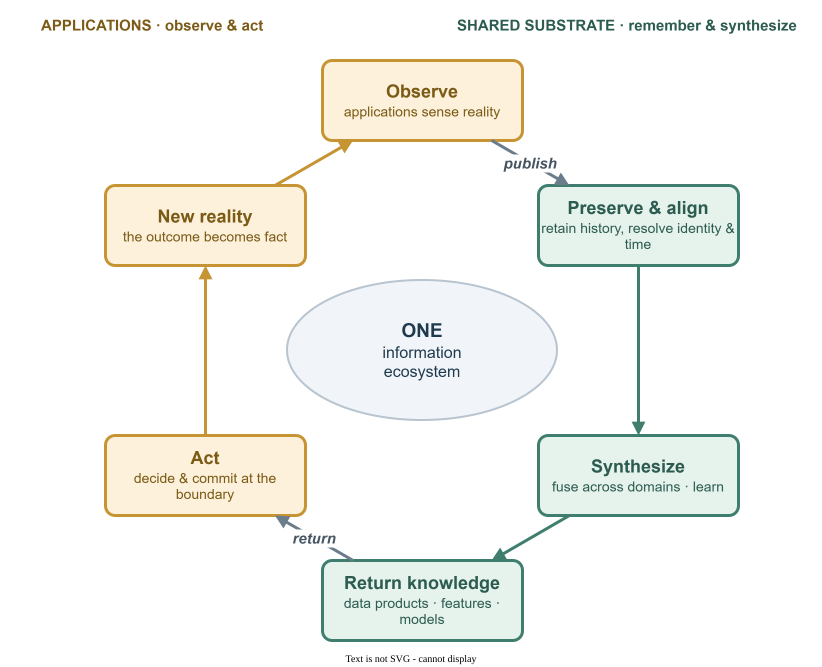
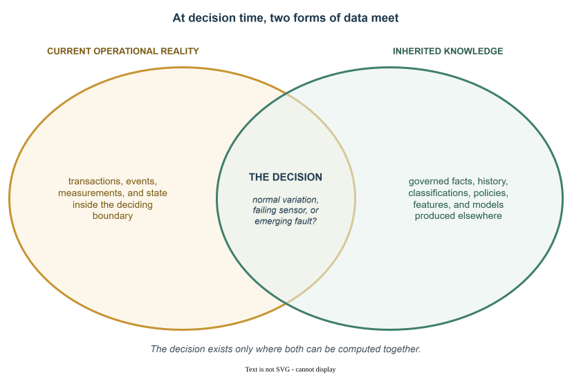
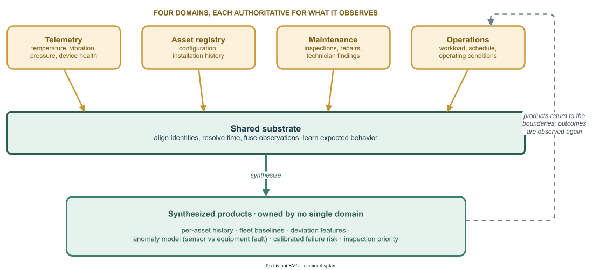

*The complete unit of software architecture is the information ecosystem.*

## Abstract

Enterprise software is commonly divided into two architectures. Operational
architecture contains applications, services, APIs, workflows, and
transactional databases. Analytical architecture contains ingestion pipelines,
a lakehouse, reporting, feature engineering, and machine learning. This division
is useful for organizing teams and technologies, but false as a model of the
system itself.

Applications observe reality and act on it. The shared data substrate preserves
those observations, aligns their meaning, fuses them across domains, and
converts them into reusable data products, statistical features, rules, and
models. That synthesized knowledge must then return to operational boundaries,
where it meets current reality and changes the next decision. Remove either side
and the system becomes incomplete: applications lose collective memory and
learning; analytical platforms become reporting systems detached from action.

This article defines the information ecosystem as the complete unit of software
architecture. It explains why applications should be treated as
observation-and-action boundaries, why the lakehouse is a foundational synthesis
layer rather than a downstream analytics annex, and why operational and
analytical processing are two functions of one closed knowledge cycle.

## 1. The split we mistake for the system

Most enterprise architecture diagrams describe two worlds.

- **The operational world** contains users, applications, services, APIs,
  messages, workflows, and transactional databases. Its concern is immediate
  action: accept a request, validate it, update state, and produce a response.
- **The analytical world** contains ingestion, historical storage,
  transformation, semantic models, reporting, experimentation, features, and
  machine learning. Its concern is memory and interpretation: preserve what
  happened, combine it, explain it, and learn from it.

The split is so familiar that it appears natural. It is not.

These are not two independent target architectures. They are two functional
views of one system. One describes the system's ability to observe and act. The
other describes its ability to remember, synthesize, and learn. Treating either
view as complete produces an architecture that can perform its assigned function
while remaining structurally disconnected from the larger cycle that gives the
function value.

The operational application without the shared knowledge layer can act, but it
must repeatedly reconstruct context through remote calls, bespoke integrations,
duplicated rules, and local approximations. The analytical platform without
operational return can remember and calculate, but its outputs terminate in
dashboards, notebooks, and model registries rather than changing the decisions
that generated the data in the first place.

The architectural error is not specialization. Separate teams, technologies, and
reliability models are often necessary. The error is mistaking a useful
organizational decomposition for a decomposition of the living system.

> **Core claim** — Operational and analytical are not separate architectures.
> They are the action and learning functions of one information ecosystem.

## 2. Applications are observation-and-action boundaries

An application is usually described by its behavior: the workflows it
implements, the rules it enforces, and the state it owns. That description is
correct but incomplete. Every application is also an observation instrument.

A web form is a set of virtual sensors. A selection, button press, submitted
value, abandoned transaction, approval, search, or correction is an observation
of external reality. The external source may be a person, a device, another
organization, or an automated process. From the perspective of the software, the
important property is the same: the event is not fully predictable in advance.
The application receives it, interprets it through an existing semantic model,
and records it.

A physical sensor reports temperature, vibration, speed, voltage, or position. A
business application reports orders, claims, decisions, account changes, service
usage, and human choices. The domain semantics differ; the architectural role
does not. Both convert events in the world into governed observations.

Applications are not passive sensors. They also act. They authorize, reserve,
recommend, price, route, reject, schedule, and commit transactions. This makes
the application an *observation-and-action boundary*: it receives current reality,
combines it with available knowledge, and produces a decision whose outcome
becomes new reality.

This dual role matters because it changes the meaning of application data. A
transaction is not merely a row required by one service. It is part of the
organization's evidence about the world. A user correction may reveal a broken
classification. A maintenance decision may label an earlier anomaly. A rejected
payment may expose a risk pattern. The application owns the operational meaning
of these observations, but their informational value may extend far beyond the
application that captured them.

The complete design question is therefore not only, "What behavior does this
application expose?" It is also:

- What reality does this application uniquely observe?
- Through which inherited semantics does it interpret that reality?
- Which observations, decisions, and outcomes should become reusable knowledge?
- What synthesized knowledge must return before the next decision?

An application architecture that cannot answer these questions describes
behavior, but not its place in the information system.

## 3. The shared substrate is memory and synthesis

The usual phrase "data platform" encourages a passive mental model: applications
operate upstream, data flows downstream, and the platform stores the residue for
analysis. In that model, the lakehouse is a destination. It is important, but
secondary.

That interpretation misses its architectural role.

A mature shared data substrate is organizational memory and a synthesis layer.
It preserves observations from many applications, aligns identities and time,
stabilizes semantics, integrates external context, calculates derivatives, and
produces reusable representations that no source application could create alone.

Calling this layer a warehouse understates the process. A warehouse stores
products that already exist. The shared substrate behaves more like a controlled
reactor. Inputs retain provenance and ownership, but they are normalized,
combined, enriched, aggregated, classified, and transformed into new products.
The output may be a conformed dataset, a historical view, a graph, a feature
set, an embedding, a policy evaluation, a statistical baseline, or a trained
model.

The key property is synthesis across boundaries.

- A **maintenance application** knows work orders and technician findings.
- A **telemetry system** knows measurements.
- An **asset registry** knows configuration.
- An **operations system** knows load and environment.

None owns equipment failure risk. That meaning emerges only when their
observations are aligned and computed together.

The shared substrate is therefore not simply a copy of operational systems. Nor
is it a single enterprise schema. It is a governed environment in which
domain-owned observations can be preserved, compared, fused, and converted into
purpose-specific knowledge.

A lakehouse is a strong contemporary implementation of this role because it can
combine durable history, data engineering, streaming, analytical computation,
feature engineering, and model lifecycle in one governed environment. The
architectural principle is broader than one product or storage format, but the
function is foundational: without a shared capacity to preserve and synthesize,
every application is forced to operate with a narrow and repeatedly reconstructed
view of reality.

## 4. Knowledge must return to action

Many analytical architectures stop too early.

They collect operational data, refine it, and present it through reports. More
advanced implementations train models and register them. These are useful
capabilities, but they do not by themselves close the system.

The cycle is complete only when synthesized knowledge returns to an operational
boundary and changes what happens next.

A statistical baseline must return to the monitoring application that evaluates a
new measurement. A customer classification must return to the service that
chooses the next interaction. A failure model must return to the maintenance or
scheduling process that can intervene. A pricing insight must return to the
decision path where a price is actually selected. The resulting decision and its
outcome must then be observed again.

This is not merely "operationalizing analytics." That phrase still assumes two
independent worlds connected at the end. The stronger model is a continuous
circulation:

> Inherited knowledge → observation → preservation → synthesis → returned
> knowledge → action → new observation

A trained model is particularly revealing. It is not an isolated analytical
artifact. It is a compressed, executable derivative of historical observations,
labels, feature logic, optimization choices, and evaluation criteria. Its value
appears only when it participates in an operational decision. The prediction,
intervention, and real-world result then become additional observations required
to evaluate and improve the model.

A business intelligence platform that never returns knowledge to action is an
open loop. An application estate that never contributes its observations to
shared learning is an amnesiac loop. The complete architecture requires both
directions.

> **Shortest formulation** — Applications observe and act. The shared substrate
> remembers and synthesizes. Knowledge returns to applications, where it meets
> current reality and changes the next action.

*Figure 1. Operational action and analytical synthesis are functions of one
circulation.*

## 5. The local intersection is where value is produced

The shared substrate does not replace the operational application. It supplies
the application with accumulated context that the application cannot create from
its own current state.

At decision time, two forms of data meet:

- **Current operational reality:** the transactions, events, measurements, and
  state inside the deciding boundary.
- **Inherited knowledge:** governed facts, history, classifications, policies,
  features, models, and synthesized products produced elsewhere.

The high-value computation occurs at their intersection.

Consider a new vibration reading from a machine. By itself, the number has little
meaning. The operational application can interpret it only by combining it with
equipment type, current operating load, previous maintenance, historical
patterns across similar assets, environmental conditions, and a learned anomaly
model. Some of this context is stable, some changes continuously, and some is a
statistical derivative of millions of earlier observations. The decision — normal
variation, failing sensor, or emerging mechanical fault — exists only at the
intersection.

*Figure 2. The decision exists only in the intersection — where current
operational reality and inherited knowledge can be computed together.*

This is why locality matters. The relevant knowledge must be computable inside
the decision boundary, or sufficiently close to it, when the application needs
flexible joins, aggregation, retrieval, or inference. "Local" does not require
every byte to be copied into the application's transactional database. The
implementation may be a local projection, a governed materialized view, an online
feature store, an embedded model, a search index, or a colocated query engine.
The requirement is computational: the application must be able to reason over the
necessary knowledge without reconstructing the context through a chain of narrow
remote calls for every decision.

This distinction is more important than latency alone. The loss caused by a thin
remote interface is not merely a few network milliseconds. It is the loss of a
*jointly computable information space*. The consumer can ask only the questions
anticipated by the provider's contract, at the grain and shape the provider
exposes. When the relevant datasets are available as governed computational
inputs, the consumer can construct new questions, intermediate representations,
and products without requiring an upstream interface change for every variation.

More data does not automatically create value. The potential increases when
semantically coherent dimensions and relationships can be computed together for a
clear purpose. The architecture should therefore synthesize the smallest
sufficiently rich knowledge package for each operational decision, rather than
replicating the enterprise indiscriminately.

## 6. Operational and reference are roles, not data types

The distinction between operational and reference data is usually treated as a
classification of datasets. In an information ecosystem, it is better understood
as a relationship between a dataset and a consuming boundary.

A balance change is operational reality inside an account-control application.
The same account state becomes inherited reference knowledge inside a usage,
forecasting, or customer-service application. Usage events are operational for
the usage system and reference for billing, account control, and capacity
planning.

The data did not change its intrinsic nature. Its architectural role changed
with the boundary.

This role relativity explains how applications participate in the same ecosystem
without surrendering ownership. The producing domain remains authoritative for
meaning and publication. The consumer receives a governed representation suitable
for its own decisions. A composite product may then combine several domains and
acquire its own product owner while preserving upstream lineage.

The mechanism can be called *role reversal*: one application's operational reality
becomes another application's reference knowledge. It is an important circulation
pattern, but it is not the complete thesis. The larger point is that applications
continuously alternate between being observers, contributors, consumers, and
actors inside one knowledge cycle.

## 7. Two incomplete architectures

Once the operational-analytical split is treated as a division of the system
rather than a division of responsibilities, two recurring failure modes appear.

### 7.1 Application architecture without collective memory

The first design treats each application as a self-contained system whose
external dependencies should be expressed primarily as behavior calls. Shared
data is considered a reporting concern. Cross-domain context is reconstructed at
request time through APIs, orchestration, caches, and bespoke endpoints.

This produces systems that are behaviorally encapsulated but informationally
poor. They can perform known interactions, yet struggle with questions that
require history, broad fan-out, multi-domain joins, or learned context. Each new
question becomes an integration project. Semantics are duplicated. Runtime
dependency graphs expand. The organization's accumulated observations remain
outside the application's reasoning boundary.

API contracts are still essential for commands, invariant-protected state
changes, and authoritative commitments. The error is using behavior invocation as
the default mechanism for all knowledge exchange.

### 7.2 Analytical architecture without operational return

The second design treats applications as data sources for a downstream
analytical estate. Data is ingested, transformed, and exposed to analysts. The
platform may add advanced machine learning, but the operational systems remain
largely unchanged. Knowledge is produced, yet the applications that could act on
it continue to operate through local rules and thin integrations.

This produces an intelligent reporting environment attached to comparatively
unintelligent operational software. The platform can explain the past and
experiment with the future, but the loop from learning to action is weak,
bespoke, or absent.

Both architectures can look successful within their own metrics. The application
platform may deliver reliable transactions. The analytical platform may deliver
trusted dashboards and accurate models. The failure becomes visible only at the
ecosystem level: knowledge does not circulate efficiently enough to change the
next operational decision.

Each half is locally coherent and globally incomplete.

## 8. A complete example: equipment operations

Consider an industrial organization with several independent applications:

- a telemetry service records temperature, vibration, pressure, and device
  health;
- an asset application owns equipment configuration and installation history;
- a maintenance application owns inspections, repairs, parts, and technician
  findings;
- an operations application owns workload, production schedule, and operating
  conditions.

A conventional application view draws four systems and their APIs. A conventional
analytical view draws pipelines from those systems into a lakehouse, followed by
dashboards and model training. Neither drawing represents the complete
architecture.

In the complete system, each application publishes the observations for which it
is authoritative. The shared substrate preserves event history, aligns equipment
identities, resolves time, combines operating conditions with maintenance
outcomes, and learns expected behavior for classes of assets.

The result is not merely an analytical table. The substrate may produce:

- a purpose-synthesized history for each asset;
- fleet-level baselines for normal behavior;
- features describing recent deviation and long-term degradation;
- an anomaly model that separates likely sensor faults from equipment faults;
- a failure-risk model with calibrated confidence;
- a recommended inspection priority.

*Figure 3. No single application owns equipment failure risk. It emerges only
when the domains' observations are aligned and computed together, then returns to
the boundaries that act.*

These products return to different operational boundaries. The telemetry
application receives an anomaly baseline. The maintenance application receives
risk, explanation, and historical context. The operations application receives
constraints or recommendations for scheduling. Each application combines the
returned knowledge with its own current reality and performs the action it owns.

The decisions then return as observations. An inspection confirms or rejects the
predicted fault. A replaced sensor labels earlier anomalies. Continued operation
without failure provides negative evidence. The shared substrate uses those
outcomes to revise features, classifications, and models.

No single application is the system. No single dataset is the intelligence. The
capability exists in the circulation among observation boundaries, the synthesis
layer, and operational action.

## 9. Architectural consequences

The model changes several default assumptions.

### 9.1 The unit of architecture review expands

An application is not fully designed when its user experience, services, APIs,
and database are specified. The review must also define the application's
participation in knowledge circulation: what it inherits, what it observes, what
it publishes, what synthesized products return, and which intersections must be
computable at decision time.

### 9.2 The lakehouse becomes a foundational application layer

The lakehouse is not underneath applications in the sense of a passive storage
tier, nor beside them as a separate analytics system. It is part of the
architecture that makes advanced application behavior possible. Operational
databases provide working state. The shared substrate provides durable memory,
semantic integration, cross-domain synthesis, and learned derivatives.

This does not mean that the lakehouse owns every domain or serves every
transaction. It means that application architecture is incomplete when it treats
the shared knowledge layer as someone else's downstream concern.

### 9.3 Knowledge and authority use different paths

Reusable knowledge should be distributed in forms that consumers can compute
over: data products, projections, features, indexes, rules, and deployable
models. Authoritative state changes should remain on owner-controlled command
paths unless authority is explicitly delegated.

A consumer may screen a decision using locally available knowledge and then
commit it through the owning domain. The same fact can be available through
several modes — projection, federation, point lookup, or command — because
freshness, reasoning capacity, policy, and authority are different concerns.

### 9.4 Data products become part of operational design

A data product is not only an analytical asset. It can be an operational
dependency with explicit semantics, history, freshness, entitlement, correction,
deletion, and delivery behavior. Its purpose is to make reusable reality
computable without transferring domain authority.

A marketplace or catalog can become the distribution fabric for these products.
Its architectural significance is not discovery alone. It replaces repeated
point-to-point reconstruction with governed, reusable knowledge that can be
projected into the consuming boundary.

### 9.5 Models are executable knowledge

Feature pipelines, model registries, evaluation, deployment, drift monitoring,
and outcome capture belong to the same lineage as the data products from which
models are derived. Machine learning is not a detached analytical architecture.
It is one synthesis mechanism inside the information ecosystem.

### 9.6 Runtime systems can become less chatty and more capable

When stable knowledge is synthesized and distributed before a request, the
application can perform more computation locally and depend on fewer synchronous
conversations during the decision. This does not necessarily reduce total data
movement. It reduces request-time dependency, repeated transfer of the same
context, and the number of remote services that must participate in each act of
reasoning.

This is a consequence of the model, not its starting claim. The primary shift is
from treating applications as isolated systems to treating them as participants
in a shared cycle of observation, synthesis, and action.

## 10. What the model does not claim

The thesis is strong, but it does not require architectural absolutism.

- It does not require every byte to be centralized or copied into every
  application.
- It does not require a single monolithic enterprise schema.
- It does not eliminate APIs, messages, commands, or transactional ownership.
- It does not assume that stale knowledge is harmless; freshness and
  reconciliation are explicit business decisions.
- It does not permit data to be persisted, derived, or retained when policy
  prohibits those uses.
- It does not claim that more data creates value by itself.
- It does not require the shared substrate to be physically centralized.
  Domain-oriented, federated, and geographically distributed implementations can
  still form one logical information ecosystem.

The requirement is not centralization. It is completeness of the circulation
model.

## 11. The information-ecosystem review

A practical architecture review can expose the missing half of a design with a
small set of questions:

- What external reality does this application observe or uniquely own?
- Which semantics, facts, history, features, policies, and models does it
  inherit?
- Which operational observations, decisions, and outcomes does it publish?
- What composite knowledge is synthesized from this and other domains?
- Which knowledge must return to the application, at what freshness and
  confidence?
- Which intersections must be computable inside the decision boundary?
- Which actions require an owner-controlled authoritative path?
- How are corrections, deletions, lineage, entitlement, and model outcomes
  carried through the loop?

A design that answers only the behavioral questions describes an application. A
design that answers only the downstream data questions describes an analytical
platform. A complete architecture explains the circulation between them.

## Prior work

This argument stands on established foundations, and it is worth naming them
plainly.

Pat Helland's *Data on the Outside versus Data on the Inside* (2005) drew the
distinction this article builds on: data inside a service boundary is current and
transactional, while data that has crossed a boundary is always from the past,
immutable, and referenced by version. The freshness and coupling limits of
cross-boundary data are his. What this article adds is treating that crossing as
a change of role — operational reality becoming another boundary's reference
knowledge — rather than only a change of freshness.

Martin Kleppmann's "Turning the Database Inside Out" (2015) established the
mechanism: an append-only log of immutable facts as the source of truth, with
every store, index, and cache treated as a derived, secondary view. Martin
Fowler's event-carried state transfer (2017) is the same movement at the level of
application events — a consumer keeps its own copy so that it need not call the
source system to act. The local projection described here is that mechanism, made
an architectural requirement and placed inside a governed, cross-domain
circulation. The honest claim of novelty is narrow: the mechanism is not new;
treating local computability as a first-class requirement, weighed against an
explicit trade space that includes reasoning capacity, is the contribution.

Data mesh (Zhamak Dehghani, 2020) supplied the governance vocabulary this article
assumes — domain ownership, data as a product, federated governance. Data mesh
named the two-way flow between operational and analytical planes as a pain and
then chose to keep their concerns separate; its 2025 reframing describes the
closed loop retroactively while conceding that few organizations built it. This
article takes the loop as the starting point: the operational re-entry of
synthesized knowledge is the part that must be designed, not deferred. The
well-documented difficulties of data mesh are largely organizational — ownership,
skills, platform maturity — and this model inherits those risks rather than
escaping them.

The convergence is also being claimed commercially. Vendors now market lakehouses
that serve transactions and analytics over one governed copy of data, and
describe operational-analytical unification as a product category. A product is
evidence that the direction is real; it is not the architectural principle. The
principle here is implementation-plural: a circulation among many applications and
domains, whatever engines and platforms happen to realize it.

## Conclusion

The operational-analytical split has been useful for organizing engineering
work. It is not a faithful model of the system being built.

Applications are observation-and-action boundaries. They capture human, machine,
and process reality; interpret it through inherited semantics; and produce
decisions and outcomes. The shared knowledge substrate preserves those
observations, fuses them across domains, and converts them into data products and
executable knowledge. That knowledge returns to operational boundaries, where it
meets current reality and changes the next action.

Remove the applications and the substrate loses its observations and its purpose.
Remove the substrate and the applications lose collective memory, cross-domain
synthesis, and learning. Neither side is an annex to the other. They are
complementary functions of one architecture.

The complete unit of software architecture is therefore not the standalone
application and not the analytical platform. It is the closed information
ecosystem in which observation becomes knowledge, knowledge returns to action,
and action produces the next observation.

> **Final thesis** — The unit of architecture is the circulation, not either
> side of it.

---

**Sources and further reading**

- Pat Helland, [*Data on the Outside versus Data on the Inside*](https://www.cidrdb.org/cidr2005/papers/P12.pdf) — CIDR 2005.
- Martin Kleppmann, [*Turning the Database Inside Out*](https://martin.kleppmann.com/2015/03/04/turning-the-database-inside-out.html) — 2015.
- Martin Fowler, [*What do you mean by "Event-Driven"?*](https://martinfowler.com/articles/201701-event-driven.html) (event-carried state transfer) — 2017.
- Zhamak Dehghani, [*Data Mesh Principles and Logical Architecture*](https://martinfowler.com/articles/data-mesh-principles.html) — 2020, and [*The data mesh challenge: closing the gap between strategy and operation at scale*](https://www.nextdata.com/our-pov/the-data-mesh-challenge-how-to-close-the-gap-between-inception-and-operation-at-scale) — 2025.
